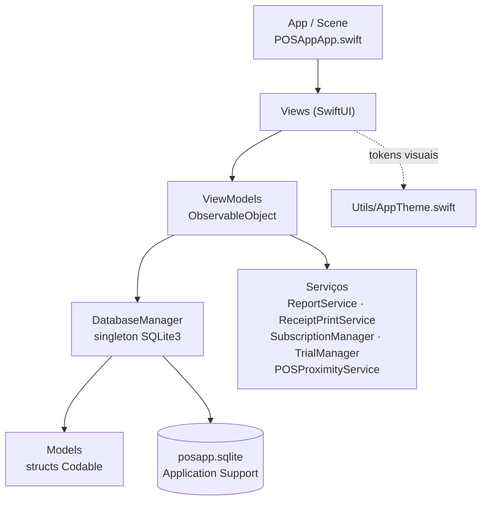
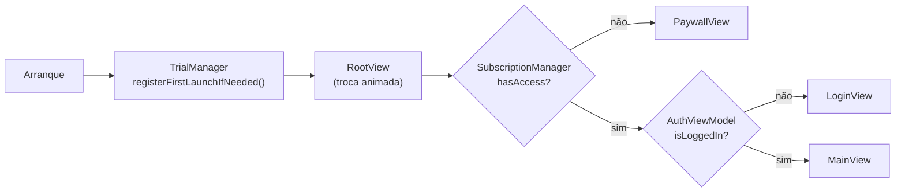
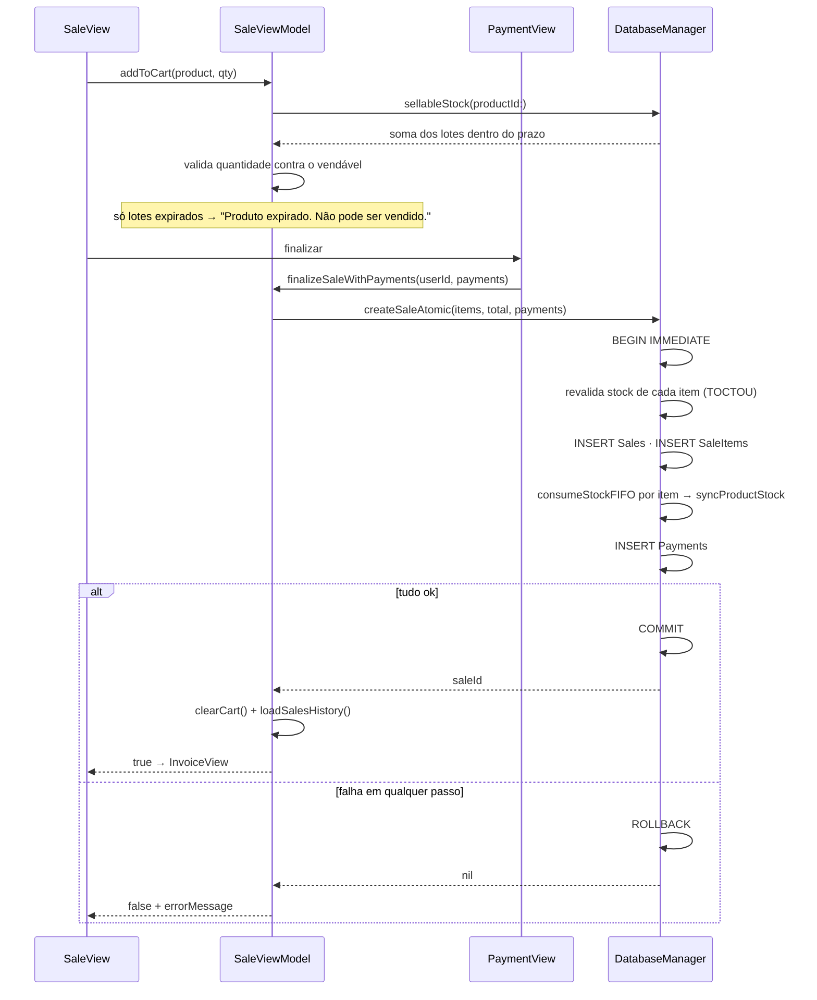

# Docs/architecture/ARCHITECTURE.md — Arquitetura do Sales POS

Documento de referência da arquitetura. **Obrigatório manter atualizado** sempre que uma camada, dependência, serviço, fluxo ou ponto de entrada mudar (ver `CLAUDE.md`, secção 2).

| | |
|---|---|
| Padrão | MVVM |
| UI | SwiftUI (+ AppKit no macOS, UIKit no iOS onde a plataforma exige) |
| Persistência | SQLite3 nativo (`libsqlite3`), ficheiro local |
| Dependências externas | Nenhuma |
| Alvos | macOS 26 · iOS 26 |

---

## 1. Camadas

### Regras de dependência (não negociáveis)

| Camada | Pode importar | Nunca pode |
|---|---|---|
| `Models/` | `Foundation` | SwiftUI · SQLite3 · ViewModels |
| `ViewModels/` | `Foundation`, `Combine`, `DatabaseManager`, Models | SwiftUI (Views), AppKit/UIKit |
| `Database/` | `Foundation`, `SQLite3`, Models | SwiftUI · ViewModels |
| `Views/` | SwiftUI, AppKit/UIKit, ViewModels, `AppTheme` | `SQLite3` · SQL em string |
| `Utils/AppTheme.swift` | SwiftUI, Models | Base de dados · regras de negócio |

Consequência prática: **uma View nunca fala com o `DatabaseManager` diretamente para escrever**. Leituras derivadas passam pelo ViewModel. Extensões de apresentação sobre modelos (cor, ícone) vivem em `AppTheme`, não no modelo.

**A validação de entradas é uma camada, não um detalhe de UI**: vive no ViewModel (catálogo em `Docs/security/SECURITY.md` §2.2.2) e repete-se no `DatabaseManager` quando decide dinheiro, stock ou perfil. Teclado, `formatter` e botões escondidos são conveniência — o mesmo ViewModel é chamado por outro ecrã, por um teste, por importação de ficheiro e pelo canal de proximidade.

---

## 2. Ponto de entrada e arranque

`@main` vive em **`Views/POSAppApp.swift`**. A decisão de ecrã não está no `Scene`:
vive na View **`RootView`** (mesmo ficheiro), para poder ler `Reduce Motion` do
ambiente e animar a troca entre paywall, login e painel principal.

- `AuthViewModel`, `CategoryViewModel`, `BatchViewModel` e `SubscriptionManager` são `@StateObject` na `App`; **os quatro** descem como `@EnvironmentObject` (o `SubscriptionManager` passou a descer porque o `RootView` o lê).
- O `onAppear` da cena faz `categoryViewModel.loadCategories()` e `batchViewModel.loadBatches()`.
- `DatabaseManager.shared` inicializa-se preguiçosamente no primeiro acesso: `openDatabase()` → `createTables()` → migrações.
- `scenePhase`:
  - `.inactive` / `.background` → grava relatório do dia (CSV + PDF) se houver vendas;
  - `.active` → revalida a subscrição (apanha cancelamentos feitos na App Store).

---

## 3. Navegação

`Views/MainView.swift` é a raiz autenticada e detém `ProductViewModel` e `SaleViewModel` como `@StateObject`. `AuthViewModel`, `CategoryViewModel` e `BatchViewModel` chegam de cima como `@EnvironmentObject`.

| ViewModel | Responsabilidade |
|---|---|
| `AuthViewModel` | Login/logout, hash e verificação de password, recusa de entrada hostil (R18), bloqueio por tentativas, `loginFailureCount` para a UI animar a recusa, define `DatabaseManager.currentUser` |
| `ProductViewModel` | Catálogo, pesquisa, stock baixo, `products(inCategory:)`, promoções (`applyDiscount`) |
| `SaleViewModel` | Carrinho (`addToCart`, `updateQuantity`, `removeFromCart`), validação de stock, venda atómica com FIFO, histórico |
| `CategoryViewModel` | CRUD de categorias, `category(for:)`, contagem de produtos por categoria, `move(from:to:)` (reordenação por arrastar, persistida em `sort_order`) |
| `BatchViewModel` | CRUD de lotes, `expiringGroups`, `realLoss`, `riskValue`, `riskBreakdown`, alerta de arranque |
| `ReportViewModel` | Agregação e exportação de relatórios: `loadDailySales`, `loadMonthlySales`, `loadAnnualSales`, `salesByHour/Day/Month`; `ReportSearchScope` + `filterReports(_:scope:date:type:)` (função pura) para o filtro do histórico |
| `AdminViewModel` | Área de Administração: estatísticas do dashboard (`revenue`/`salesCount`/`averageTicket`/`itemsSold` por `Period`, `revenueSeries(in:)` — série com granularidade hora/dia/mês, `paymentMix`, `topProducts`, `revenueByCategory`; filtro de data do período `Total` em `DateFilter` (ano/mês/dia) + a regra pura `apply(_:to:calendar:)`, `availableYears`, `daysInSelectedMonth`, `periodLabel(_:)`), validade (`riskEntries`, `lossEntries`, `riskBreakdown`), produtos parados (`staleProducts(months:)` + a regra pura `isStale(lastSale:limit:)`), fecho por caixa (`cashierStatuses(date:)`, `closeCashier`, `reopenCashier`) e correcção a partir da Administração (`updateBatch(_:)` — quantidade e validade de um lote; `updateStock(productId:newStock:)` — reposição de stock) |
| `DayCloseViewModel` | Resumos de fecho por dia, mês e **ano** (`loadDay`, `loadMonth`, `loadYear`), histórico de fechos e exportações Excel/PDF via `CloseExportService` (definido em `Views/DayClose/DayCloseView.swift`) |

| Plataforma | Contentor | Separadores (`AppTab`) |
|---|---|---|
| macOS | `NavigationSplitView` com sidebar | Vendas · Produtos* · Relatórios* · Fecho de Caixa · Administração* · Definições* |
| iOS | `TabView` | idem |

\* Só a `role == .admin`. O perfil Caixa vê apenas **Vendas** e **Fecho de Caixa** — e dentro do Fecho de Caixa só a secção "Caixas", onde fecha a sua própria caixa. Esconder na UI é a segunda barreira: a primeira é a autorização em `DatabaseManager` (`saveCashierClose` recusa fechar a caixa de outro utilizador a quem não é Admin).

No arranque, `MainView` corre `runStartupChecks()` **uma única vez**: se `BatchViewModel.shouldShowExpiryAlert()` for verdadeiro apresenta o sheet `ExpiryAlertView`, e só no `onDismiss` desse sheet dispara o alerta de fecho de caixa pendente (se não houver validade a mostrar, o alerta de fecho dispara logo). Os dois avisos nunca se sobrepõem. O item "Produtos" leva um badge permanente com a contagem de lotes fora de `.safe`/`.none` — `ExpiryBadge` no `Label` da sidebar (macOS) e `.badge()` no `tabItem` (iOS).

Divergências de plataforma isoladas com `#if os(macOS)` dentro do mesmo ficheiro — nunca Views duplicadas por plataforma.

---

## 4. Camada de dados

`Database/DatabaseManager.swift` — singleton, **fonte única de SQL**.

- Ficheiro: `applicationSupportDirectory/posapp.sqlite` (`Constants.dbName`), com permissões `0o600` e, em iOS, `FileProtectionType.completeUntilFirstUserAuthentication`.
- `PRAGMA foreign_keys = ON` imediatamente a seguir a `sqlite3_open` (é por ligação, não persiste no ficheiro).
- API síncrona sobre `sqlite3_*` C. Todas as queries usam `sqlite3_prepare_v2` + `sqlite3_bind_*` — **nunca interpolação de strings**. As ligações de texto passam `SQLITE_TRANSIENT` (o SQLite copia o valor): com `nil`/`SQLITE_STATIC` o ponteiro da `NSString` temporária podia morrer antes do `sqlite3_step` e o valor ligado virava lixo (ver `Docs/development/ERRORS.md` E23).
- Tabelas: `Users`, `Products`, `Sales`, `SaleItems`, `Payments`, `DayCloses`, `Reports`, `Categories`, `Batches`, `AuditLog`.
- Migrações são idempotentes, no padrão `PRAGMA table_info(...)` + `ALTER TABLE` (`migrateAddBarcode`, `migrateAddPaymentsTable`, `migrateAddDayClosesTable`, `migrateAddCategoryToProducts`, `seedDefaultCategories`, `migrateStockToBatches`).
- Mapeamento linha → modelo centralizado em helpers privados (`productFromStatement`, `saleFromStatement`, `paymentFromStatement`, `dayCloseFromStatement`). Coluna nova = atualizar o helper, o `SELECT`, o `INSERT` e o `UPDATE`.
- Diagnóstico (`print`) só em `#if DEBUG` e **nunca com o caminho da base de dados**.

### Transações

`func transaction<T>(_ body: () -> T?) -> T?` corre `body` entre `BEGIN IMMEDIATE` e `COMMIT`; `nil` devolvido pelo corpo (ou falha do `COMMIT`) dispara `ROLLBACK`. **Não é reentrante** — métodos usados dentro de transações têm variante privada sem transação própria (`consumeStockFIFOUnsafe`, `insertBatch`, `insertPayments`, `createSaleItem`).

### Autorização (camada de dados)

`DatabaseManager.currentUser` é definido por `AuthViewModel.login` e limpo no `logout`. Métodos privilegiados devolvem `false`/`nil` quando o perfil não chega:

| Operação | Requer |
|---|---|
| `deleteUser` | Admin; nunca o último Admin |
| `updateUser` | Admin, ou o próprio utilizador (sem mudar o seu perfil); nunca despromove o último Admin |
| `deleteProduct` | Admin |
| `updateProduct` com alteração de preço | Admin |
| `deleteSale` | Admin |
| `reopenDayClose` | Admin |

Eventos sensíveis passam por `logAudit(action:entity:entityId:userId:)` → tabela `AuditLog`.

### Stock

`Products.stock` é **cache de leitura**; a fonte de verdade é a soma de `Batches.quantity`. Para **vender** vale o `sellableStock(productId:)` — soma só dos lotes dentro do prazo. Stock expirado conta para perdas e para o `availableStock`, nunca para a venda. Toda a escrita em `Batches` termina em `syncProductStock(productId:)`. `updateStock(productId:newStock:)` mantém a assinatura antiga mas ajusta lotes (aumenta/cria o lote sem validade, reduz por FIFO).

Esquema completo e diagrama ER em [[DATABASE]].

---

## 5. Fluxo principal — venda

Regras de negócio e onde vivem:

| Regra | Local |
|---|---|
| Preço final = base × (1 + margem) × (1 + IVA) | `Product.calculateFinalPrice` |
| Validação de stock no carrinho | `SaleViewModel.addToCart` e `SaleViewModel.updateQuantity` (contra `sellableStock`, não contra `Product.stock`) |
| Produto expirado não se vende | `DatabaseManager.sellableStock` + `consumeStockFIFO(excludeExpired: true)` dentro de `createSaleAtomic` |
| Preço praticado na venda (com promoção) | `Product.priceWithDiscount` — usado por `SaleViewModel.addToCart` |
| Promoção de um produto (0…90%) | `ProductViewModel.applyDiscount` → `DatabaseManager.setProductDiscount` (Admin, com `AuditLog`) |
| Stock baixo (`<= 10`) | `ProductViewModel.lowStockProducts` |
| Desconto de stock ao vender | `DatabaseManager.consumeStockFIFO`, dentro de `createSaleAtomic` |
| Ordem de consumo dos lotes | `expiry_date ASC`, `NULL` por último |
| Faixas de validade | `Models/ExpiryStatus.swift` — fonte única |
| Perda real / valor em risco | `BatchViewModel.realLoss` · `riskValue` · `riskBreakdown` |
| Alerta de validade no arranque | `BatchViewModel.shouldShowExpiryAlert()` + `Constants.expiryAlertDismissedDateKey` |
| Hash de password (PBKDF2-HMAC-SHA256) | `AuthViewModel.hashPassword` / `verifyPassword` |
| Bloqueio após 5 falhas de login | `AuthViewModel` (30 s, estado só em memória) |
| Formatação de moeda (locale) | `Utils/Constants.swift` — `formatCurrency` |
| Nome do programa (UI, talões, relatórios, fechos) | `Constants.appName` (lê/escreve `UserDefaults` na chave `Constants.appNameKey`); validação em `Constants.sanitizedAppName` |
| Células numéricas e BOM do CSV | `Utils/CSVField.swift` — `csvNumber`, `csvBOM` |
| Cor por método de pagamento | `AppTheme.methodColor` |
| Cor de categoria e de faixa de validade | `AppTheme` — `Category.color`, `ExpiryStatus.color` |

---

## 6. Serviços

| Serviço | Ficheiro | Framework | Papel |
|---|---|---|---|
| `ReportService` | `Views/Reports/ReportService.swift` | AppKit (`NSAttributedString`, contexto PDF) | Gera CSV e PDF de relatórios diários/mensais/anuais/agrupados e regista em `Reports`. O `drawText` desenha no contexto PDF **sem flip de coordenadas** — o contexto já é Y-para-cima, e um `scaleBy(y: -1)` com `NSGraphicsContext(flipped: false)` fazia os glifos saírem espelhados |
| `ReceiptPrintService` | `Views/Sales/ReceiptPrintService.swift` | AppKit + PDFKit | Desenha o talão da factura em PDF na largura do formato (`ReceiptFormat.thermal80` = 226,77 pt contínuo · `.a4` = 595 × 842 pt paginado) e entrega-o ao painel de impressão do sistema (`PDFDocument.printOperation`), onde se escolhe a impressora. Ficheiros só na directoria da app; sem vendas devolve `nil` |
| `CloseExportService` | `Views/Reports/CloseExportService.swift` | AppKit | Exportação do fecho de caixa |
| `LowStockExportService` | `Views/LowStockExportService.swift` | Foundation | Exportação da lista de stock baixo |
| `SubscriptionManager` | `Views/Subscription/SubscriptionManager.swift` | StoreKit 2 | Produtos, compra, restauro, `Transaction.updates`, verificação de assinatura |
| `TrialManager` | `Views/Subscription/TrialManager.swift` | `UserDefaults` | Data de primeiro arranque e período de teste |
| `POSProximityService` | `Views/POSProximityService.swift` | `Network` (Bonjour: `NWListener`/`NWBrowser`/`NWConnection`) | Anúncio, descoberta e envio de stock entre dispositivos |
| `ProximityManager` | `List_Storage/ProximityManager.swift` | `Network` + UIKit | Equivalente no alvo `List_Storage` (iOS) |

| `ReportExportState` | `Views/Reports/ReportComponents.swift` | Foundation | Orquestra a exportação a partir da UI: estado de progresso do PDF, toast de sucesso e revelar no Finder (macOS) / `ShareSheet` (iOS). Não exporta nada por si — chama sempre o `ReportService`. Partilhado por `DailyReportView`, `MonthlyReportView` e `AnnualReportView`. |

`ReportViewModel` é o ViewModel local dos ecrãs de relatório: agrega vendas (total, itens, ranking `topProducts` até 50, séries de facturação/nº de vendas/itens por dia e por mês) e delega toda a exportação ao `ReportService`. `topProduct(for:)` é derivado de `topProducts(for:limit:)` — uma só contagem em toda a app. O filtro do histórico vive lá como função pura (`filterReports`), testada em `POSAppTests/ReportFilterTests.swift` — a View só escolhe âmbito e data.

`BatchViewModel` acrescenta o detalhe de risco de validade: `riskEntries(products:)` devolve `ProductRiskEntry` (produto, lotes em alerta, quantidade e valor, ordenado por valor) e `worstStatus(productId:)` dá a faixa mais grave de um produto — usados pelo badge da lista em `ProductListView` e pelo alerta de arranque. O detalhe visual desse risco vive agora em `AdminExpiryView`, alimentado pelo `AdminViewModel`.

`DayCloseViewModel` cobre as três janelas de fecho. Só o **fecho do dia** persiste (`DayCloses`); mês e ano são leituras agregadas para conferência e exportação, com o mesmo `CloseSummary` e os mesmos componentes de UI.

O separador **Administração** (`Views/Admin/`) fica entre Fecho de Caixa e Definições e agrupa o que é gestão da loja: `AdminDashboardView` (cabeçalho com o período + os seis indicadores numa grelha de colunas iguais (3 · 2 · 1) com a Receita em destaque, painel de gráfico com seletor Receita · Vendas por caixa em Swift Charts, e as distribuições na coluna lateral, em duas colunas que empilham em ecrã estreito), `AdminExpiryView` (validade e stock baixo — substitui os cartões de estado e o painel lateral que viviam em `ProductListView`), `StaleProductsView` (produtos sem venda há 6+ meses, com promoção à mão) e os dois históricos, `CloseHistoryView` e `ReportHistoryView`, que saíram de Fecho de Caixa e de Relatórios.

Em Administração › Validade, "Em risco" ordena os produtos pelo **prazo mais curto** (não pelo valor) e mostra os dias que faltam; qualquer lote — em risco ou expirado — abre o `BatchEditSheet` (quantidade + data de validade) e qualquer produto em "Stock baixo" abre o `StockEditSheet` (reposição). Ambos gravam pelo `AdminViewModel`, nunca directamente pela View. As duas folhas partilham cabeçalho, campo de passo e rodapé (`EditSheetHeader`, `StepperField`, `EditSheetFooter`, privados a `AdminExpiryView.swift`) e usam um único plano de vidro tingido pela cor do estado. Em Administração › Parados, os indicadores usam o `AdminKPICard` normal — vidro neutro, cor só no ícone e no valor, igual às restantes secções da Administração.

O separador Fecho de Caixa tem as secções Caixas · Dia · Mês · Ano; o histórico passou para Administração. "Caixas" é `CashierCloseAdminView`: o Admin vê todas as caixas do dia (fechada ou por fechar) e pode fechar ou reabrir cada uma; o Caixa vê só a sua e tem sempre acção sobre ela — "Fechar a minha caixa" quando está por fechar, "Actualizar o meu fecho" quando já foi fechada (por ele ou pelo Admin), o que apanha as vendas feitas depois do fecho. Reabrir continua a ser só do Admin.

O **Guia** (`Views/Posguideview.swift`) é filtrado pelo perfil: `POSGuideView(isAdmin:)` esconde os capítulos dos ecrãs que o Caixa não tem (Produtos, Lotes, Relatórios, Definições, Partilha iOS) e adapta o conteúdo de Visão Geral, Fecho de Caixa e Atalhos. Em macOS, `POSGuideWindowController.open(isAdmin:)` refaz a janela quando o perfil muda.

O separador Relatórios entra sempre por `ReportsHomeView` (`Views/MainView.swift`), um picker segmentado com Diário · Mensal · Anual, igual em macOS e iOS. É deliberado não usar `TabView`: o `TabView` instancia todas as secções em simultâneo e os `.toolbar` de cada uma fundem-se na mesma barra, o que punha dois botões "Exportar" na janela ao mesmo tempo. Com o picker só existe a secção activa, logo só o seu botão.

Componentes de UI partilhados vivem em `Utils/AppTheme.swift`: `CategoryChipView` (chip de categoria — fonte única usada pela lista de produtos, pelas barras de filtro de Produtos e Vendas, pela grelha de seleção do formulário de produto e pela pré-visualização em `CategoryFormView`) e `AppEmptyStateView`. `Utils/CategoryIcons.swift` guarda a grelha fixa de SF Symbols oferecida ao escolher o ícone de uma categoria.

---

## 7. Alvos do projeto

| Alvo | Pasta | Plataforma | Função |
|---|---|---|---|
| `Sales_Project` (POS) | `Sales_Project/`, `Models/`, `ViewModels/`, `Database/`, `Views/`, `Utils/` | macOS + iOS | Aplicação principal de ponto de venda |
| `List_Storage` | `List_Storage/` | iOS | Gestão/lista de stock com CSV e envio por proximidade |
| `POSAppTests` | `POSAppTests/` | — | 16 ficheiros, 118 testes em 27 suites (Swift Testing), plano `Sales_Project.xctestplan` com `parallelizable: false`. Índice e o que cada suite resolve em `Docs/development/TESTING.md` |

O alvo usa **lista explícita de ficheiros** (não pasta sincronizada): ficheiro novo obriga a registo no `project.pbxproj`, com IDs únicos — é a causa recorrente de builds partidos (`Docs/development/ERRORS.md` E3/E4).

Os dois alvos partilham conceitos (produto, proximidade) mas **têm modelos próprios** — `Models/Product.swift` (POS) e `List_Storage/Product.swift` (lista) são tipos distintos. Não fundir sem tarefa dedicada no `TODO.md`.

---

## 8. Concorrência

- `DatabaseManager` é **síncrono** e chamado a partir do MainActor. Não há fila dedicada: uma escrita longa bloqueia a UI.
- Trabalho assíncrono existe só onde é inevitável: renderização de PDF (`async`), StoreKit (`Task`), rede de proximidade (callbacks do `Network` reenviados para a main queue).
- Regra: qualquer publicação de `@Published` a partir de um callback de rede ou de `Task` tem de chegar ao MainActor.

---

## 9. Dívida arquitetural conhecida

Registada aqui para não se perder; converter em tarefas no `Docs/TODO.md` antes de mexer.

1. **Dois pontos de entrada** — `Sales_Project/Sales_ProjectApp.swift` tem o `@main` comentado e cria um admin com password fixa no `init`. Código morto e risco de segurança: apagar ou reativar, nunca deixar ambíguo.
2. **`Sales_Project/ContentView.swift`** é boilerplate do Xcode, não usado.
3. ~~**Venda sem transação**~~ — resolvido: `createSaleAtomic` corre tudo em `BEGIN IMMEDIATE`/`COMMIT`/`ROLLBACK` e `createSale` delega nele.
4. ~~**`createSale` chama `fetchProducts()` dentro do ciclo de itens**~~ — resolvido: usa `availableStock(productId:)` e `fetchProduct(id:)`.
5. **Sem fila de base de dados** — ver secção 8. Com transações, uma escrita longa passa a bloquear também os leitores.
5b. **`transaction(_:)` não é reentrante** — SQLite não aceita `BEGIN` aninhado. Métodos públicos que abrem transação (`createBatch`, `updateBatch`, `deleteBatch`, `updateStock`, `deleteCategory`, `deleteSale`, `createProduct`, `consumeStockFIFO`) não podem ser chamados de dentro de outra transação; usar as variantes privadas.
6. **`ReportService` e `ReceiptPrintService` usam AppKit/PDFKit** — a geração de PDF e a impressão são, na prática, macOS-only.
7. **Liquid Glass parcialmente aplicado** — já em uso nos relatórios (`ReportComponents`, com `GlassEffectContainer`), nos cards de venda, no painel de perdas, nos ecrãs de categoria e no **Login** (cartão do formulário, plano único). Faltam os restantes ecrãs: Fecho de Caixa, Definições e Pagamento (ver `Docs/development/STYLE_GUIDE.md`).

---

## 10. Onde acrescentar código novo

| Vou acrescentar… | Vai para |
|---|---|
| Tabela/coluna/query | `Database/DatabaseManager.swift` (+ atualizar [[DATABASE]]) |
| Entidade nova | `Models/<Nome>.swift` (struct `Codable`, sem SwiftUI) |
| Estado e regras de um ecrã | `ViewModels/<Nome>ViewModel.swift` |
| Ecrã novo | `Views/<Área>/<Nome>View.swift` |
| Cor, ícone, componente partilhado | `Utils/AppTheme.swift` |
| Exportação de ficheiro | Reutilizar `ReportService` — não escrever exportador novo |
| Impressão de talão/factura | Reutilizar `ReceiptPrintService` + `PrintFormatSheet` — não abrir `NSPrintOperation` na View |
| Gráfico novo | Reutilizar `VerticalBarsCard` (`Views/Reports/ReportComponents.swift`, Swift Charts) |
| Partilha em iOS | Reutilizar `List_Storage/ShareSheet.swift` |
| Validação de um campo novo | `ViewModels/<Nome>ViewModel.swift` (+ registo em [[SECURITY]] §11 e teste em `POSAppTests/`) |
| Teste novo | `POSAppTests/<Assunto>Tests.swift` (+ linha no índice de [[TESTING]] e registo no alvo `POSAppTests`) |
| Erro resolvido | Entrada em [[ERRORS]] com sintoma, causa, solução e prova |
