# Diagrama do Sistema — POS Sales_Project

> Diagramas em **Mermaid**. Regra do projeto (`CLAUDE.md`, secção 9): tudo o que for representável em Mermaid é escrito em Mermaid — ASCII só onde o Mermaid não tem tipo de diagrama equivalente (wireframes de UI). Dados tabulares vão em tabela Markdown, nunca em caixas ASCII.

Índice:

| Secção | O que cobre |
|---|---|
| [Arquitetura Geral](#arquitetura-geral) | Camadas Views → ViewModels → DatabaseManager → Models |
| [Fluxo de Venda](#fluxo-de-venda) | Carrinho → pagamento → transação SQL → fatura |
| [Ciclo de Vida de um Lote](#ciclo-de-vida-de-um-lote) | Recepção, faixas de validade, consumo FIFO |
| [Alerta de Validade no Arranque](#alerta-de-validade-no-arranque) | `shouldShowExpiryAlert()` e "Dispensar hoje" |
| [Exportação de Relatórios](#exportação-de-relatórios) | Secções Diário/Mensal/Anual/Histórico · CSV/PDF → Finder (macOS) / ShareSheet (iOS) |
| [Subscrição e Período de Teste](#subscrição-e-período-de-teste) | Paywall, StoreKit 2, Keychain |
| [Partilha por Proximidade](#partilha-por-proximidade) | Bonjour, TLS com PSK, transferência |

---

## Arquitetura Geral

Espelha [[ARCHITECTURE]] (`Docs/architecture/ARCHITECTURE.md`) — nenhuma camada nova é inventada aqui.

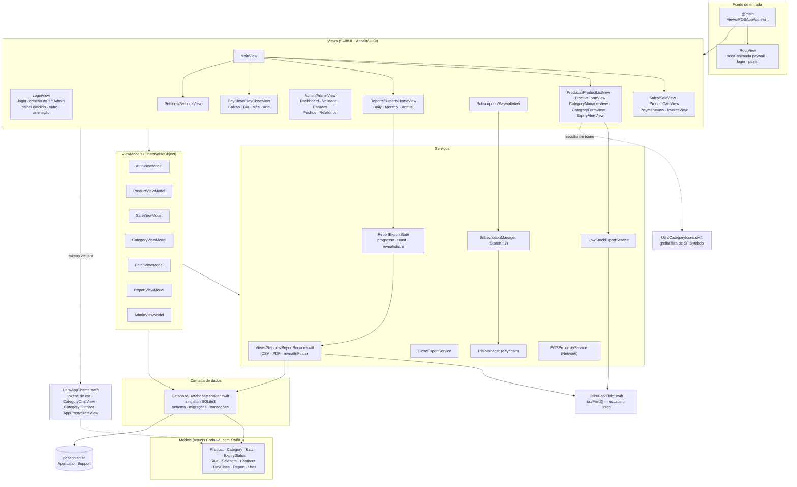
```mermaid
flowchart TD
    subgraph APP["Ponto de entrada"]
        MAIN["@main<br/>Views/POSAppApp.swift"]
        ROOT["RootView<br/>troca animada paywall · login · painel"]
        MAIN --> ROOT
    end

    subgraph V["Views (SwiftUI + AppKit/UIKit)"]
        MV["MainView"]
        LV["LoginView<br/>login · criação do 1.º Admin<br/>painel dividido · vidro · animação"]
        SV["Sales/SaleView · ProductCardView<br/>PaymentView · InvoiceView"]
        PV["Products/ProductListView · ProductFormView<br/>CategoryManagerView · CategoryFormView · ExpiryAlertView"]
        RV["Reports/ReportsHomeView<br/>Daily · Monthly · Annual"]
        DV["DayClose/DayCloseView<br/>Caixas · Dia · Mês · Ano"]
        ADV["Admin/AdminView<br/>Dashboard · Validade · Parados<br/>Fechos · Relatórios"]
        STV["Settings/SettingsView"]
        PWV["Subscription/PaywallView"]
    end

    subgraph VM["ViewModels (ObservableObject)"]
        AVM["AuthViewModel"]
        PVM["ProductViewModel"]
        SVM["SaleViewModel"]
        CVM["CategoryViewModel"]
        BVM["BatchViewModel"]
        RVM["ReportViewModel"]
        ADVM["AdminViewModel"]
    end

    subgraph SRV["Serviços"]
        RS["Views/Reports/ReportService.swift<br/>CSV · PDF · revealInFinder"]
        RES["ReportExportState<br/>progresso · toast · reveal/share"]
        CES["CloseExportService"]
        LSE["LowStockExportService"]
        SUB["SubscriptionManager (StoreKit 2)"]
        TM["TrialManager (Keychain)"]
        PS["POSProximityService (Network)"]
    end

    subgraph DB["Camada de dados"]
        DBM["Database/DatabaseManager.swift<br/>singleton SQLite3<br/>schema · migrações · transações"]
    end

    subgraph M["Models (structs Codable, sem SwiftUI)"]
        MD["Product · Category · Batch · ExpiryStatus<br/>Sale · SaleItem · Payment · DayClose · Report · User"]
    end

    UT["Utils/AppTheme.swift<br/>tokens de cor · CategoryChipView · CategoryFilterBar · AppEmptyStateView"]
    CI["Utils/CategoryIcons.swift<br/>grelha fixa de SF Symbols"]
    CSVU["Utils/CSVField.swift<br/>csvField() — escaping único"]
    FILE[("posapp.sqlite<br/>Application Support")]

    MAIN --> V
    MV --> SV
    MV --> PV
    MV --> RV
    MV --> DV
    MV --> STV

    V --> VM
    VM --> DBM
    DBM --> MD
    DBM --> FILE

    VM --> SRV
    RV --> RES
    RES --> RS
    PV --> LSE
    PV -.->|"escolha de ícone"| CI
    RS --> CSVU
    LSE --> CSVU
    RS --> DBM
    PWV --> SUB
    SUB --> TM

    V -.->|"tokens visuais"| UT
    UT -.-> MD
```

Regras de dependência que o diagrama impõe:

| Camada | Pode importar | Nunca pode |
|---|---|---|
| `Models/` | `Foundation` | SwiftUI · SQLite3 · ViewModels |
| `ViewModels/` | `Foundation`, `Combine`, `DatabaseManager`, Models | SwiftUI · AppKit/UIKit |
| `Database/` | `Foundation`, `SQLite3`, Models | SwiftUI · ViewModels |
| `Views/` | SwiftUI, AppKit/UIKit, ViewModels, `AppTheme` | `SQLite3` · SQL em string |

---

## Fluxo de Login

`RootView` (em `Views/POSAppApp.swift`) escolhe o ecrã e anima a troca. O `LoginView`
tem um só plano de vidro — o cartão do formulário — sobre um fundo `MeshGradient`.

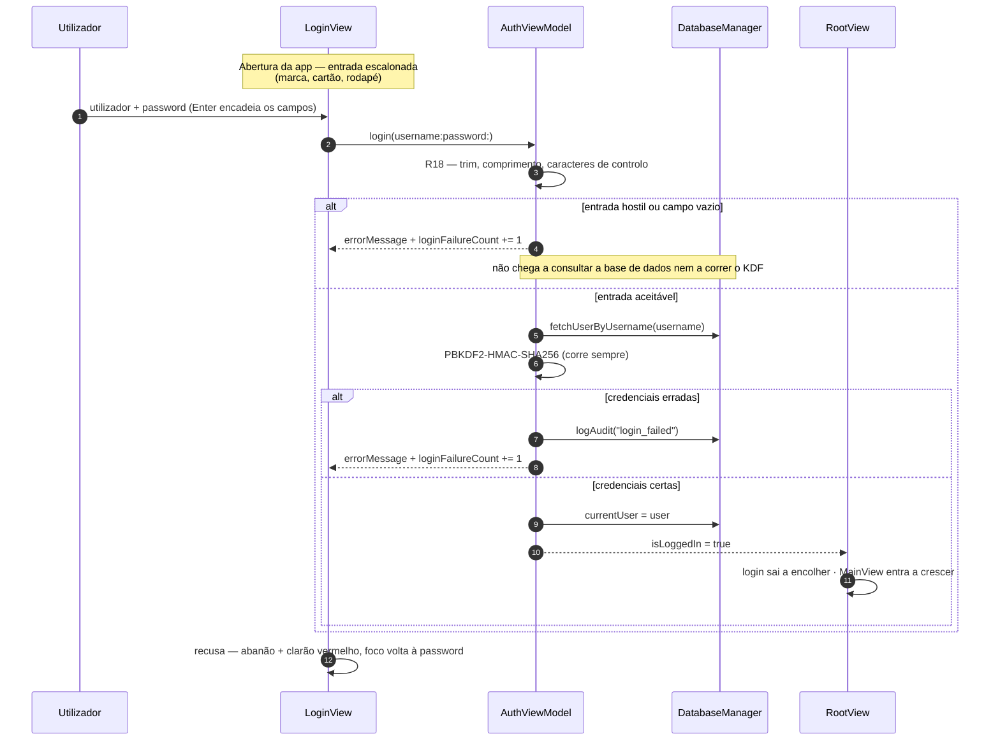
```mermaid
sequenceDiagram
    autonumber
    participant U as Utilizador
    participant LV as LoginView
    participant AVM as AuthViewModel
    participant DB as DatabaseManager
    participant RV as RootView

    Note over LV: Abertura da app — entrada escalonada<br/>(marca, cartão, rodapé)
    U->>LV: utilizador + password (Enter encadeia os campos)
    LV->>AVM: login(username:password:)
    AVM->>AVM: R18 — trim, comprimento, caracteres de controlo
    alt entrada hostil ou campo vazio
        AVM-->>LV: errorMessage + loginFailureCount += 1
        Note over AVM,DB: não chega a consultar a base de dados nem a correr o KDF
    else entrada aceitável
        AVM->>DB: fetchUserByUsername(username)
        AVM->>AVM: PBKDF2-HMAC-SHA256 (corre sempre)
        alt credenciais erradas
            AVM->>DB: logAudit("login_failed")
            AVM-->>LV: errorMessage + loginFailureCount += 1
        else credenciais certas
            AVM->>DB: currentUser = user
            AVM-->>RV: isLoggedIn = true
            RV->>RV: login sai a encolher · MainView entra a crescer
        end
    end
    LV->>LV: recusa — abanão + clarão vermelho, foco volta à password
```

Estados do ecrã:

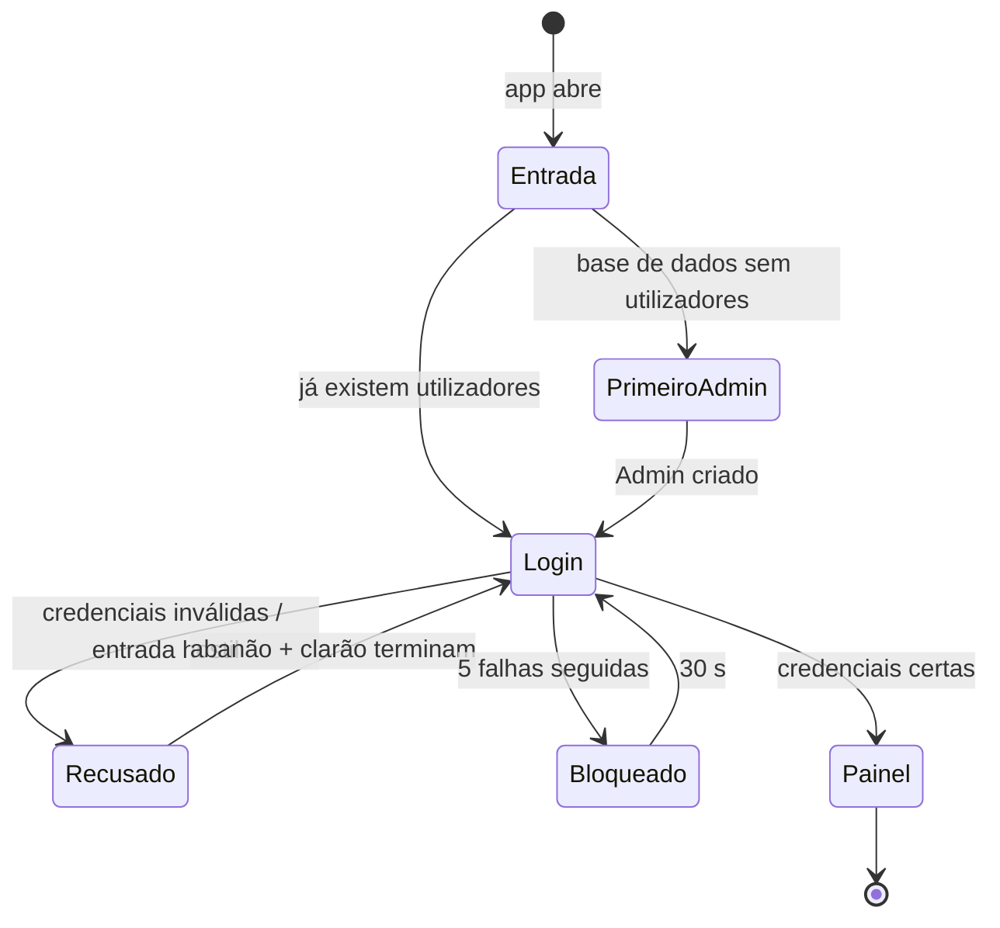
```mermaid
stateDiagram-v2
    [*] --> Entrada: app abre
    Entrada --> Login: já existem utilizadores
    Entrada --> PrimeiroAdmin: base de dados sem utilizadores
    PrimeiroAdmin --> Login: Admin criado
    Login --> Recusado: credenciais inválidas / entrada hostil
    Recusado --> Login: abanão + clarão terminam
    Login --> Bloqueado: 5 falhas seguidas
    Bloqueado --> Login: 30 s
    Login --> Painel: credenciais certas
    Painel --> [*]
```

| Sinal de recusa | Com movimento | Com `Reduce Motion` |
|---|---|---|
| Abanão horizontal do ecrã | 14 pt, 5 fotogramas, ~0,4 s | desligado (amplitude 0) |
| Clarão vermelho radial | 0,1 s a entrar, 0,5 s a sair | mantém-se — é o sinal que sobra |
| Banner `Credenciais inválidas.` | aparece de cima, com opacidade | aparece sem animação |

---

## Fluxo de Venda

Toda a escrita da venda corre dentro de **uma transação** (`BEGIN IMMEDIATE` … `COMMIT` / `ROLLBACK`): Sales, SaleItems, consumo de stock e Payments são atómicos.

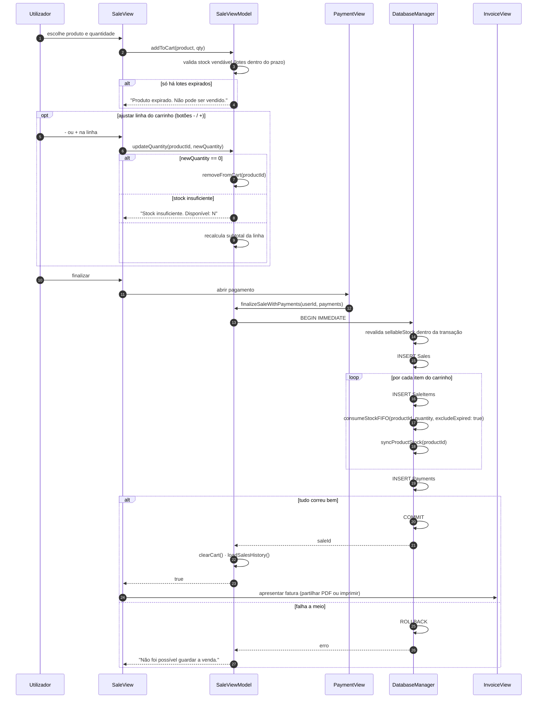
```mermaid
sequenceDiagram
    autonumber
    participant U as Utilizador
    participant SV as SaleView
    participant SVM as SaleViewModel
    participant PV as PaymentView
    participant DB as DatabaseManager
    participant IV as InvoiceView

    U->>SV: escolhe produto e quantidade
    SV->>SVM: addToCart(product, qty)
    SVM->>SVM: valida stock vendável (lotes dentro do prazo)
    alt só há lotes expirados
        SVM-->>SV: "Produto expirado. Não pode ser vendido."
    end
    opt ajustar linha do carrinho (botões - / +)
        U->>SV: - ou + na linha
        SV->>SVM: updateQuantity(productId, newQuantity)
        alt newQuantity == 0
            SVM->>SVM: removeFromCart(productId)
        else stock insuficiente
            SVM-->>SV: "Stock insuficiente. Disponível: N"
        else
            SVM->>SVM: recalcula subtotal da linha
        end
    end
    U->>SV: finalizar
    SV->>PV: abrir pagamento
    PV->>SVM: finalizeSaleWithPayments(userId, payments)

    SVM->>DB: BEGIN IMMEDIATE
    DB->>DB: revalida sellableStock dentro da transação
    DB->>DB: INSERT Sales
    loop por cada item do carrinho
        DB->>DB: INSERT SaleItems
        DB->>DB: consumeStockFIFO(productId, quantity, excludeExpired: true)
        DB->>DB: syncProductStock(productId)
    end
    DB->>DB: INSERT Payments

    alt tudo correu bem
        DB->>DB: COMMIT
        DB-->>SVM: saleId
        SVM->>SVM: clearCart() · loadSalesHistory()
        SVM-->>SV: true
        SV->>IV: apresentar fatura (partilhar PDF ou imprimir)
    else falha a meio
        DB->>DB: ROLLBACK
        DB-->>SVM: erro
        SVM-->>SV: "Não foi possível guardar a venda."
    end
```

### Layout do ecrã de venda e de pagamento

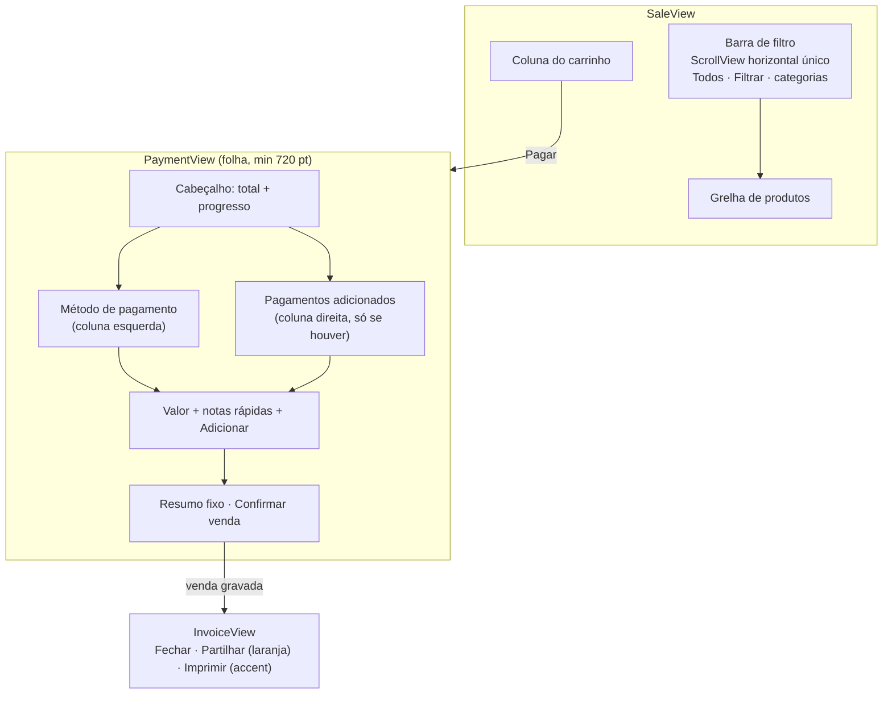
```mermaid
flowchart TB
    subgraph SVL["SaleView"]
        FB["Barra de filtro<br/>ScrollView horizontal único<br/>Todos · Filtrar · categorias"]
        GRID["Grelha de produtos"]
        CART["Coluna do carrinho"]
        FB --> GRID
    end

    subgraph PVL["PaymentView (folha, min 720 pt)"]
        HDR["Cabeçalho: total + progresso"]
        MET["Método de pagamento<br/>(coluna esquerda)"]
        ENT["Pagamentos adicionados<br/>(coluna direita, só se houver)"]
        AMT["Valor + notas rápidas + Adicionar"]
        SUM["Resumo fixo · Confirmar venda"]
        HDR --> MET
        HDR --> ENT
        MET --> AMT
        ENT --> AMT
        AMT --> SUM
    end

    CART -->|Pagar| PVL
    SUM -->|venda gravada| IVL["InvoiceView<br/>Fechar · Partilhar (laranja) · Imprimir (accent)"]
```

- A barra de filtro da `SaleView` é **um só** `ScrollView(.horizontal)` — com muitas categorias os chips deslizam lado a lado em vez de transbordarem para cima da coluna do carrinho.
- Na `PaymentView`, "Pagamentos adicionados" fica **ao lado** de "Método de pagamento"; sem entradas, a coluna direita não é desenhada.

---

## Impressão da Factura (80 mm · A4)

A factura pode ser impressa no fim da venda (`InvoiceView`) ou reimpressa a
partir do detalhe de uma factura nos relatórios (`SaleGroupDetailView`). Os dois
caminhos abrem a mesma folha (`PrintFormatSheet`), que escolhe o formato e
entrega o PDF ao painel de impressão do sistema — é aí que se escolhe a
impressora.

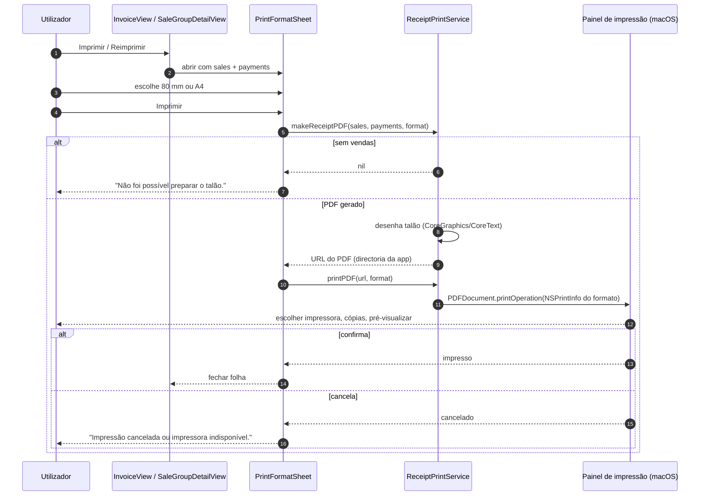
```mermaid
sequenceDiagram
    autonumber
    participant U as Utilizador
    participant V as InvoiceView / SaleGroupDetailView
    participant PS as PrintFormatSheet
    participant RPS as ReceiptPrintService
    participant SYS as Painel de impressão (macOS)

    U->>V: Imprimir / Reimprimir
    V->>PS: abrir com sales + payments
    U->>PS: escolhe 80 mm ou A4
    U->>PS: Imprimir
    PS->>RPS: makeReceiptPDF(sales, payments, format)
    alt sem vendas
        RPS-->>PS: nil
        PS-->>U: "Não foi possível preparar o talão."
    else PDF gerado
        RPS->>RPS: desenha talão (CoreGraphics/CoreText)
        RPS-->>PS: URL do PDF (directoria da app)
        PS->>RPS: printPDF(url, format)
        RPS->>SYS: PDFDocument.printOperation(NSPrintInfo do formato)
        SYS-->>U: escolher impressora, cópias, pré-visualizar
        alt confirma
            SYS-->>PS: impresso
            PS-->>V: fechar folha
        else cancela
            SYS-->>PS: cancelado
            PS-->>U: "Impressão cancelada ou impressora indisponível."
        end
    end
```

### Formatos de papel

| Formato | Largura | Altura | Uso |
|---|---|---|---|
| `ReceiptFormat.thermal80` | 226,77 pt (80 mm) | contínua (cresce com o conteúdo) | Impressora térmica de balcão |
| `ReceiptFormat.a4` | 595 pt | 842 pt, paginado | Impressora normal |

---

## Área de Administração

Só existe para `role == .admin` e fica entre **Fecho de Caixa** e **Definições**.
Junta o que é gestão da loja e não é operação de balcão. Os cartões de estado e o
painel lateral que viviam na lista de Produtos passaram para aqui, redesenhados.

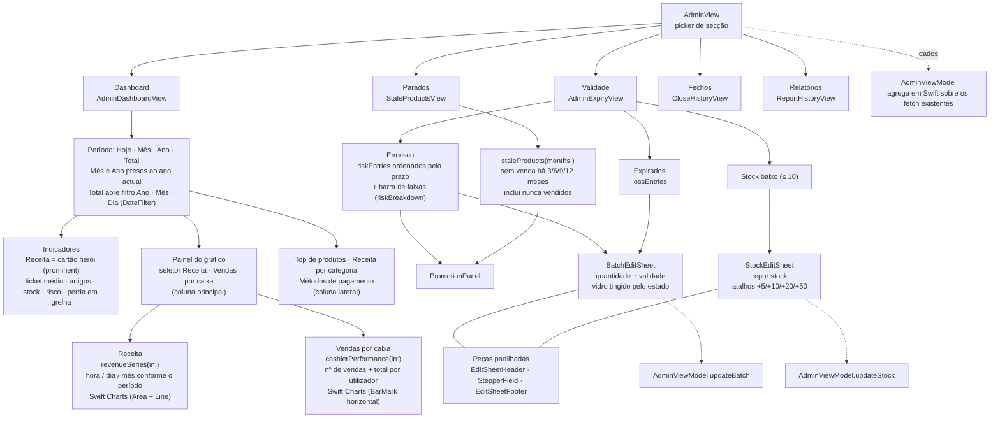
```mermaid
flowchart TD
    A["AdminView<br/>picker de secção"] --> B["Dashboard<br/>AdminDashboardView"]
    A --> C["Validade<br/>AdminExpiryView"]
    A --> D["Parados<br/>StaleProductsView"]
    A --> E["Fechos<br/>CloseHistoryView"]
    A --> F["Relatórios<br/>ReportHistoryView"]

    B --> B0["Período: Hoje · Mês · Ano · Total<br/>Mês e Ano presos ao ano actual<br/>Total abre filtro Ano · Mês · Dia (DateFilter)"]
    B0 --> B1["Indicadores<br/>Receita = cartão herói (prominent)<br/>ticket médio · artigos · stock · risco · perda em grelha"]
    B0 --> B2["Painel do gráfico<br/>seletor Receita · Vendas por caixa<br/>(coluna principal)"]
    B2 --> B2a["Receita<br/>revenueSeries(in:)<br/>hora / dia / mês conforme o período<br/>Swift Charts (Area + Line)"]
    B2 --> B2b["Vendas por caixa<br/>cashierPerformance(in:)<br/>nº de vendas + total por utilizador<br/>Swift Charts (BarMark horizontal)"]
    B0 --> B4["Top de produtos · Receita por categoria<br/>Métodos de pagamento<br/>(coluna lateral)"]

    C --> C1["Em risco<br/>riskEntries ordenados pelo prazo<br/>+ barra de faixas (riskBreakdown)"]
    C --> C2["Expirados<br/>lossEntries"]
    C --> C3["Stock baixo (≤ 10)"]
    C1 --> P["PromotionPanel"]
    C1 --> BE["BatchEditSheet<br/>quantidade + validade<br/>vidro tingido pelo estado"]
    C2 --> BE
    C3 --> SE["StockEditSheet<br/>repor stock<br/>atalhos +5/+10/+20/+50"]
    BE --- SH["Peças partilhadas<br/>EditSheetHeader · StepperField · EditSheetFooter"]
    SE --- SH
    BE -.-> VMB["AdminViewModel.updateBatch"]
    SE -.-> VMS["AdminViewModel.updateStock"]

    D --> D1["staleProducts(months:)<br/>sem venda há 3/6/9/12 meses<br/>inclui nunca vendidos"]
    D1 --> P

    A -.->|dados| VM["AdminViewModel<br/>agrega em Swift sobre os fetch existentes"]
```

**Risco e perda são conjuntos disjuntos**: um lote já expirado aparece só em
"Expirados" (`lossEntries`), um lote ainda dentro do prazo só em "Em risco"
(`riskEntries`) — os totais batem certo com `realLoss` e `riskValue`.

---

## Produtos Parados (6+ meses)

Um produto está **parado** quando ainda tem stock em lotes e não vende há mais de
N meses — nunca ter sido vendido conta como parado. A regra é pura
(`AdminViewModel.isStale(lastSale:limit:)`) e testada sem base de dados.

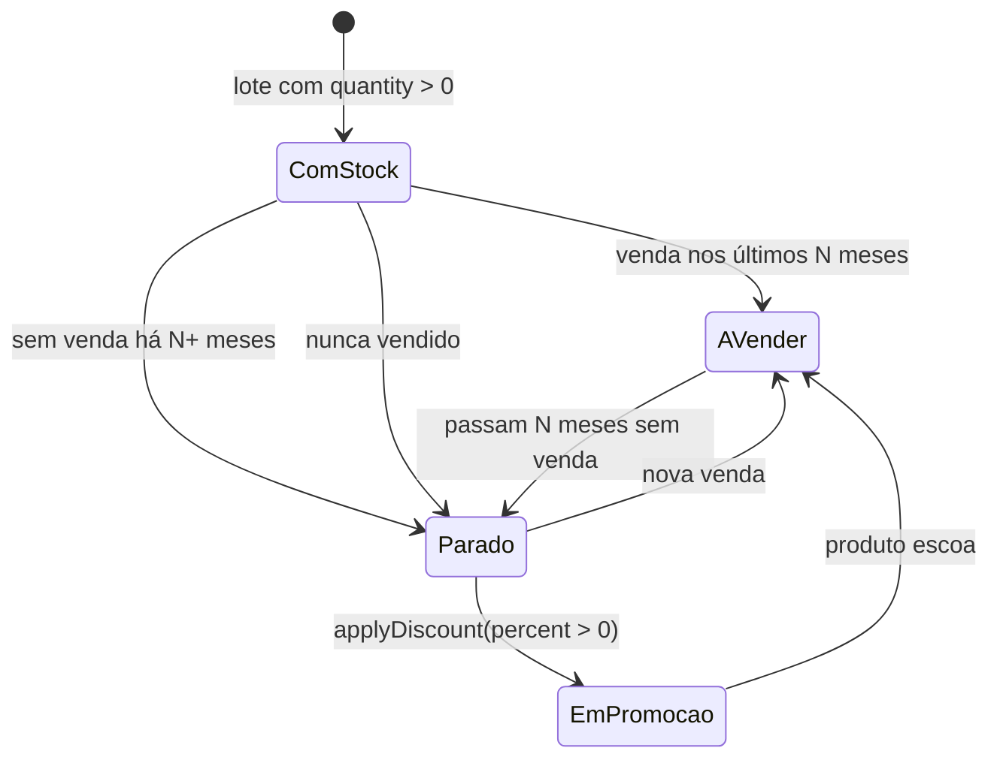
```mermaid
stateDiagram-v2
    [*] --> ComStock: lote com quantity > 0
    ComStock --> AVender: venda nos últimos N meses
    ComStock --> Parado: sem venda há N+ meses
    ComStock --> Parado: nunca vendido
    AVender --> Parado: passam N meses sem venda
    Parado --> AVender: nova venda
    Parado --> EmPromocao: applyDiscount(percent > 0)
    EmPromocao --> AVender: produto escoa
```

No arranque, e no máximo uma vez por dia, o Admin recebe o alerta "Produtos
parados" com a contagem e o atalho para **Administração › Parados**
(`Constants.staleAlertDismissedDateKey`).

---

## Fecho por Caixa

`DayCloses` continua a ser o fecho da **loja** (agregado do dia).
`CashierCloses` é o fecho da caixa de **cada utilizador**, um registo por
`(data, utilizador)`.

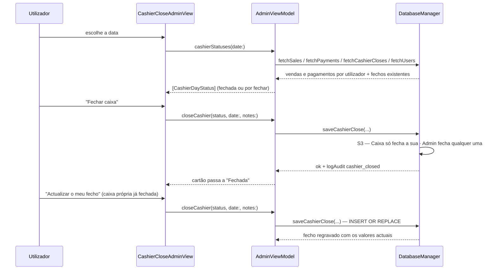
```mermaid
sequenceDiagram
    participant U as Utilizador
    participant V as CashierCloseAdminView
    participant VM as AdminViewModel
    participant DB as DatabaseManager

    U->>V: escolhe a data
    V->>VM: cashierStatuses(date:)
    VM->>DB: fetchSales / fetchPayments / fetchCashierCloses / fetchUsers
    DB-->>VM: vendas e pagamentos por utilizador + fechos existentes
    VM-->>V: [CashierDayStatus] (fechada ou por fechar)

    U->>V: "Fechar caixa"
    V->>VM: closeCashier(status, date:, notes:)
    VM->>DB: saveCashierClose(...)
    DB->>DB: S3 — Caixa só fecha a sua · Admin fecha qualquer uma
    DB-->>VM: ok + logAudit cashier_closed
    VM-->>V: cartão passa a "Fechada"

    U->>V: "Actualizar o meu fecho" (caixa própria já fechada)
    V->>VM: closeCashier(status, date:, notes:)
    VM->>DB: saveCashierClose(...) — INSERT OR REPLACE
    DB-->>VM: fecho regravado com os valores actuais
```

O perfil Caixa vê apenas esta secção dentro de Fecho de Caixa, filtrada à sua
própria caixa; o Admin vê todas e pode reabrir (`reopenCashierClose`, só Admin).

Acções por estado da **caixa própria** — ela nunca fica sem acção para o dono,
mesmo que o Admin já a tenha fechado:

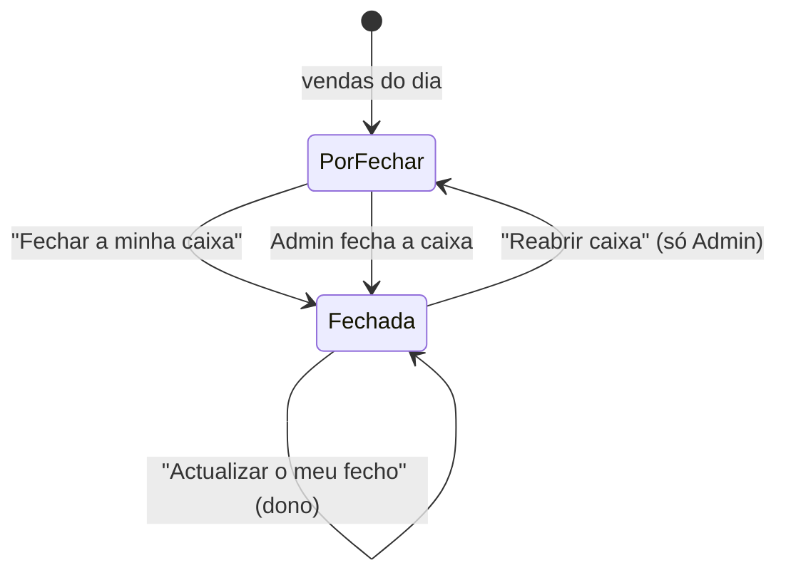
```mermaid
stateDiagram-v2
    [*] --> PorFechar: vendas do dia
    PorFechar --> Fechada: "Fechar a minha caixa"
    PorFechar --> Fechada: Admin fecha a caixa
    Fechada --> Fechada: "Actualizar o meu fecho" (dono)
    Fechada --> PorFechar: "Reabrir caixa" (só Admin)
```

---

## Promoção de Produto a Expirar

Na lista de Produtos, um produto com lotes em alerta (a expirar, mas ainda
dentro do prazo) mostra a acção **Promoção**, e **qualquer** produto abre o menu
de contexto (botão direito em macOS, toque longo em iOS) com "Fazer promoção",
"Remover promoção", "Editar produto" e "Apagar produto". A mesma acção existe em
**Administração › Validade** e **Administração › Parados**. O painel desce de
cima com animação e aplica o desconto ao produto.
O desconto passa a ser o **preço praticado na venda** (`priceWithDiscount`).

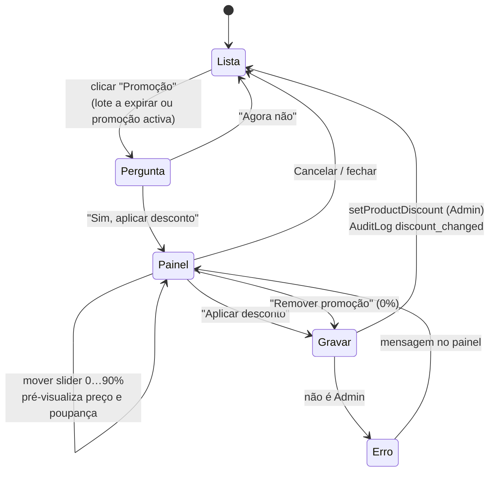
```mermaid
stateDiagram-v2
    [*] --> Lista
    Lista --> Pergunta: clicar "Promoção"<br/>(lote a expirar ou promoção activa)
    Pergunta --> Lista: "Agora não"
    Pergunta --> Painel: "Sim, aplicar desconto"
    Painel --> Painel: mover slider 0…90%<br/>pré-visualiza preço e poupança
    Painel --> Lista: Cancelar / fechar
    Painel --> Gravar: "Aplicar desconto"
    Painel --> Gravar: "Remover promoção" (0%)
    Gravar --> Lista: setProductDiscount (Admin)<br/>AuditLog discount_changed
    Gravar --> Erro: não é Admin
    Erro --> Painel: mensagem no painel
```

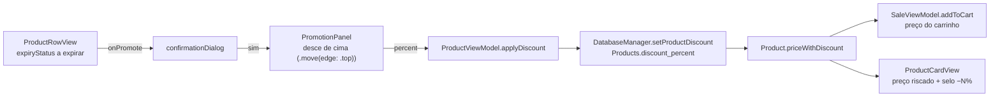
```mermaid
flowchart LR
    A["ProductRowView<br/>expiryStatus a expirar"] -->|onPromote| B["confirmationDialog"]
    B -->|sim| C["PromotionPanel<br/>desce de cima (.move(edge: .top))"]
    C -->|percent| D["ProductViewModel.applyDiscount"]
    D --> E["DatabaseManager.setProductDiscount<br/>Products.discount_percent"]
    E --> F["Product.priceWithDiscount"]
    F --> G["SaleViewModel.addToCart<br/>preço do carrinho"]
    F --> H["ProductCardView<br/>preço riscado + selo −N%"]
```

---

## Ciclo de Vida de um Lote

Faixas definidas em `Models/ExpiryStatus.swift` — **fonte única**. A partir dos dias que faltam até `expiry_date`:

| Dias restantes | `ExpiryStatus` |
|---|---|
| `< 0` | `.expired` |
| `0...30` | `.days` |
| `31...60` | `.oneMonth` |
| `61...90` | `.twoMonths` |
| `91...120` | `.threeMonths` |
| `> 120` | `.safe` |
| `expiryDate == nil` | `.none` |

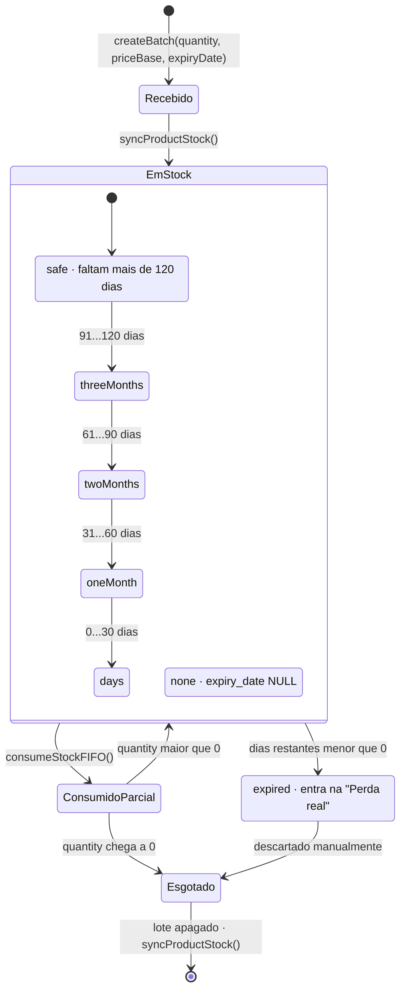
```mermaid
stateDiagram-v2
    [*] --> Recebido: createBatch(quantity, priceBase, expiryDate)
    Recebido --> EmStock: syncProductStock()

    state EmStock {
        [*] --> Safe
        Safe: safe · faltam mais de 120 dias
        Safe --> TresMeses: 91...120 dias
        TresMeses: threeMonths
        TresMeses --> DoisMeses: 61...90 dias
        DoisMeses: twoMonths
        DoisMeses --> UmMes: 31...60 dias
        UmMes: oneMonth
        UmMes --> Dias: 0...30 dias
        Dias: days
        SemValidade: none · expiry_date NULL
    }

    EmStock --> Expirado: dias restantes menor que 0
    Expirado: expired · entra na "Perda real"

    EmStock --> ConsumidoParcial: consumeStockFIFO()
    ConsumidoParcial --> EmStock: quantity maior que 0
    ConsumidoParcial --> Esgotado: quantity chega a 0
    Esgotado --> [*]: lote apagado · syncProductStock()

    Expirado --> Esgotado: descartado manualmente
```

O FIFO ordena por `expiry_date ASC` com os lotes sem validade (`NULL`) no fim: sai primeiro o que expira mais cedo.

---

## Alerta de Validade no Arranque

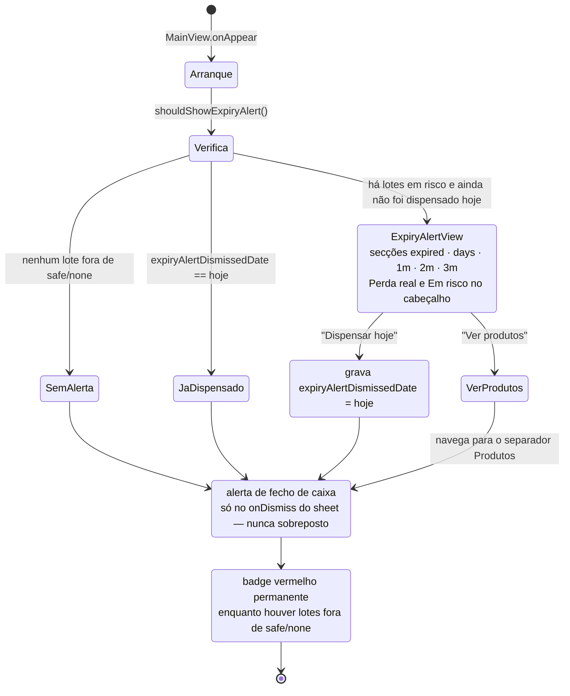
```mermaid
stateDiagram-v2
    [*] --> Arranque: MainView.onAppear
    Arranque --> Verifica: shouldShowExpiryAlert()

    Verifica --> SemAlerta: nenhum lote fora de safe/none
    Verifica --> JaDispensado: expiryAlertDismissedDate == hoje
    Verifica --> MostraSheet: há lotes em risco e ainda não foi dispensado hoje

    SemAlerta --> FechoPendente
    JaDispensado --> FechoPendente

    MostraSheet: ExpiryAlertView<br/>secções expired · days · 1m · 2m · 3m<br/>Perda real e Em risco no cabeçalho
    MostraSheet --> VerProdutos: "Ver produtos"
    MostraSheet --> DispensarHoje: "Dispensar hoje"

    DispensarHoje: grava expiryAlertDismissedDate = hoje
    DispensarHoje --> FechoPendente
    VerProdutos --> FechoPendente: navega para o separador Produtos

    FechoPendente: alerta de fecho de caixa<br/>só no onDismiss do sheet — nunca sobreposto
    FechoPendente --> BadgeSidebar

    BadgeSidebar: badge vermelho permanente<br/>enquanto houver lotes fora de safe/none
    BadgeSidebar --> [*]
```

`runStartupChecks()` corre uma única vez por sessão (`startupChecksDone`): o sheet de validade e o alerta de fecho de caixa são sequenciais, nunca simultâneos.

---

## Exportação de Relatórios

Um só serviço (`ReportService`) para todos os formatos — não se escrevem exportadores novos.

### Navegação das secções

`ReportsHomeView` é o ponto único de entrada, em macOS e iOS. Só a secção
seleccionada existe, por isso só o `.toolbar` dela chega à barra da janela —
é o que garante um único botão "Exportar" de cada vez.

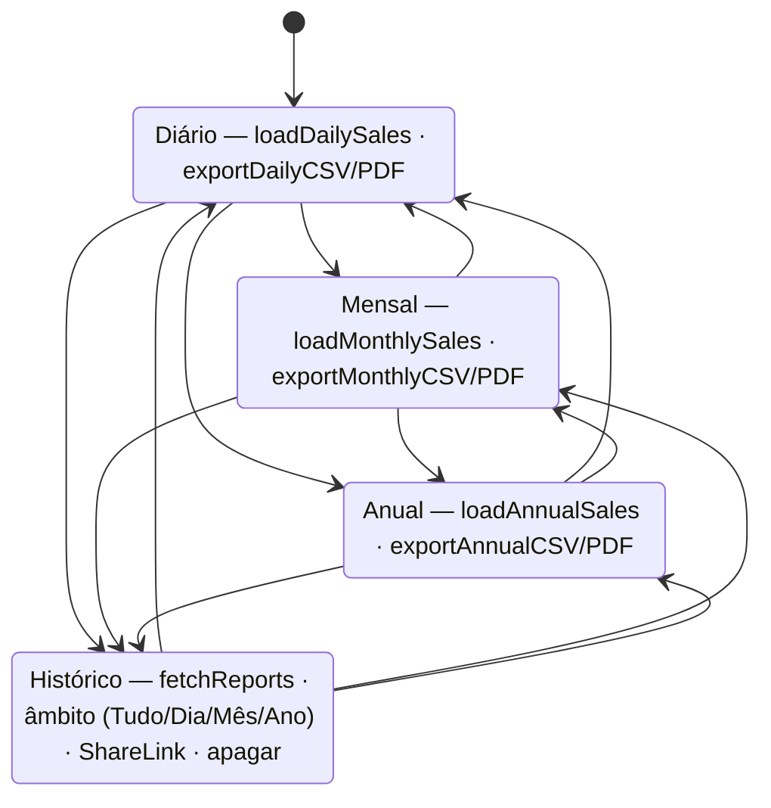
```mermaid
stateDiagram-v2
    [*] --> Diario
    Diario --> Mensal
    Diario --> Anual
    Diario --> Historico
    Mensal --> Diario
    Mensal --> Anual
    Mensal --> Historico
    Anual --> Diario
    Anual --> Mensal
    Anual --> Historico
    Historico --> Diario
    Historico --> Mensal
    Historico --> Anual

    Diario: Diário — loadDailySales · exportDailyCSV/PDF
    Mensal: Mensal — loadMonthlySales · exportMonthlyCSV/PDF
    Anual: Anual — loadAnnualSales · exportAnnualCSV/PDF
    Historico: Histórico — fetchReports · âmbito (Tudo/Dia/Mês/Ano) · ShareLink · apagar
```

Cada secção abre com o `ReportSummaryHeader`: à esquerda o total e os
contadores (vendas · itens), à direita o `TopProductsPanel` com os **50 produtos
mais vendidos** do período (quantidade e valor), a ocupar a altura das duas
linhas. Mensal e Anual acrescentam gráficos de barras verticais
(`VerticalBarsCard`, Swift Charts): facturação, nº de vendas e itens vendidos —
por dia no Mensal, por mês no Anual.

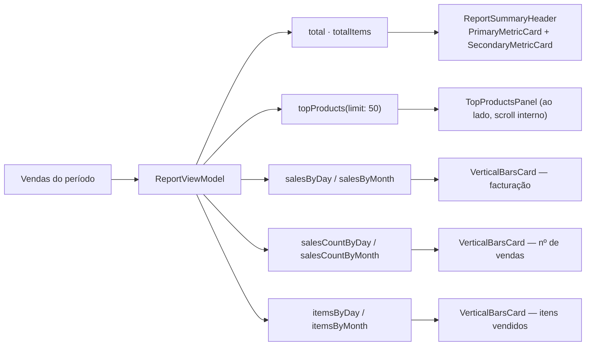
```mermaid
flowchart LR
    S["Vendas do período"] --> VM["ReportViewModel"]
    VM --> T["total · totalItems"]
    VM --> TP["topProducts(limit: 50)"]
    VM --> G1["salesByDay / salesByMonth"]
    VM --> G2["salesCountByDay / salesCountByMonth"]
    VM --> G3["itemsByDay / itemsByMonth"]

    T --> H["ReportSummaryHeader<br/>PrimaryMetricCard + SecondaryMetricCard"]
    TP --> P["TopProductsPanel (ao lado, scroll interno)"]
    G1 --> C["VerticalBarsCard — facturação"]
    G2 --> C2["VerticalBarsCard — nº de vendas"]
    G3 --> C3["VerticalBarsCard — itens vendidos"]
```

Cada secção lista as facturas do período em `SaleCardsGrid` — cards quadrados
(`SaleReportRowView`) numa `LazyVGrid` adaptativa, com o detalhe, a
**reimpressão** (80 mm/A4) e os botões CSV/PDF em sheet (`SaleGroupDetailView`).

### Geração e entrega do ficheiro

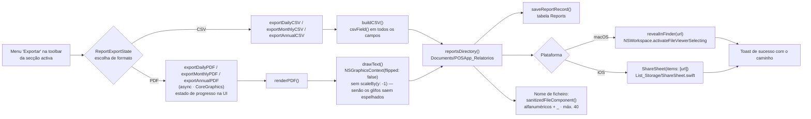
```mermaid
flowchart LR
    A["Menu 'Exportar' na toolbar<br/>da secção activa"] --> B{"ReportExportState<br/>escolha de formato"}
    B -->|CSV| C["exportDailyCSV / exportMonthlyCSV / exportAnnualCSV"]
    B -->|PDF| D["exportDailyPDF / exportMonthlyPDF / exportAnnualPDF<br/>(async · CoreGraphics)<br/>estado de progresso na UI"]

    C --> E["buildCSV()<br/>csvField() em todos os campos"]
    D --> F["renderPDF()"]

    E --> G["reportsDirectory()<br/>Documents/POSApp_Relatorios"]
    F --> F2["drawText()<br/>NSGraphicsContext(flipped: false)<br/>sem scaleBy(y: -1) — senão os glifos saem espelhados"]
    F2 --> G
    G --> H["saveReportRecord()<br/>tabela Reports"]

    G --> I{"Plataforma"}
    I -->|macOS| J["revealInFinder(url)<br/>NSWorkspace.activateFileViewerSelecting"]
    I -->|iOS| K["ShareSheet(items: [url])<br/>List_Storage/ShareSheet.swift"]

    G --> L["Nome de ficheiro:<br/>sanitizedFileComponent()<br/>alfanuméricos + _ · máx. 40"]
    J --> M["Toast de sucesso com o caminho"]
    K --> M
```


### Histórico de relatórios — pesquisa por dia, mês ou ano

O filtro é uma função pura no `ReportViewModel`; a View só escolhe o âmbito e
a data (o filtro por tipo foi removido do ecrã). Um âmbito mais largo apanha o
que está dentro dele — o `period` guardado é sempre `yyyy`, `yyyy-MM` ou
`yyyy-MM-dd`, logo basta comparar o prefixo. O ecrã tem duas colunas: painel de
pesquisa à esquerda, lista de relatórios à direita.

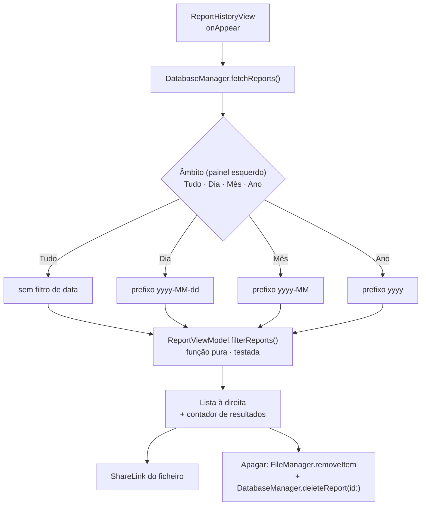
```mermaid
flowchart TD
    A["ReportHistoryView<br/>onAppear"] --> B["DatabaseManager.fetchReports()"]
    B --> D{"Âmbito (painel esquerdo)<br/>Tudo · Dia · Mês · Ano"}
    D -->|Tudo| E["sem filtro de data"]
    D -->|Dia| F["prefixo yyyy-MM-dd"]
    D -->|Mês| G["prefixo yyyy-MM"]
    D -->|Ano| H["prefixo yyyy"]

    E --> I["ReportViewModel.filterReports()<br/>função pura · testada"]
    F --> I
    G --> I
    H --> I

    I --> J["Lista à direita<br/>+ contador de resultados"]
    J --> K["ShareLink do ficheiro"]
    J --> L["Apagar: FileManager.removeItem<br/>+ DatabaseManager.deleteReport(id:)"]
```

---

## Fecho de Caixa (dia · mês · ano)

Só o fecho do dia é escrito na base de dados. Mês e ano são leituras
agregadas para conferência e exportação, com o mesmo `CloseSummary`. Os três
ecrãs usam o mesmo bloco: cartões por método à esquerda e gráfico de barras
**verticais** ao lado (`VerticalBarsCard`). A coluna direita difere por
período: no dia o gráfico tem altura fixa e as **Notas** ficam por baixo dele;
no mês e no ano o gráfico estica até ao fundo dos cartões.

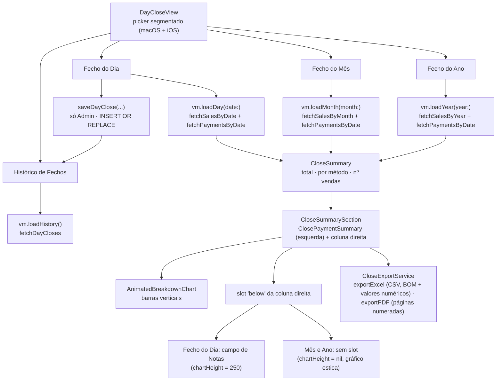
```mermaid
flowchart TD
    DCV["DayCloseView<br/>picker segmentado (macOS + iOS)"] --> DIA["Fecho do Dia"]
    DCV --> MES["Fecho do Mês"]
    DCV --> ANO["Fecho do Ano"]
    DCV --> HIST["Histórico de Fechos"]

    DIA --> LD["vm.loadDay(date:)<br/>fetchSalesByDate + fetchPaymentsByDate"]
    MES --> LM["vm.loadMonth(month:)<br/>fetchSalesByMonth + fetchPaymentsByDate"]
    ANO --> LA["vm.loadYear(year:)<br/>fetchSalesByYear + fetchPaymentsByDate"]
    HIST --> LH["vm.loadHistory()<br/>fetchDayCloses"]

    LD --> RES["CloseSummary<br/>total · por método · nº vendas"]
    LM --> RES
    LA --> RES

    RES --> UI["CloseSummarySection<br/>ClosePaymentSummary (esquerda) + coluna direita"]
    UI --> CH["AnimatedBreakdownChart<br/>barras verticais"]
    UI --> BELOW["slot 'below' da coluna direita"]
    BELOW --> NOTAS["Fecho do Dia: campo de Notas<br/>(chartHeight = 250)"]
    BELOW --> VAZIO["Mês e Ano: sem slot<br/>(chartHeight = nil, gráfico estica)"]
    UI --> EXP["CloseExportService<br/>exportExcel (CSV, BOM + valores numéricos) · exportPDF (páginas numeradas)"]

    DIA --> SAVE["saveDayClose(...)<br/>só Admin · INSERT OR REPLACE"]
    SAVE --> HIST
```

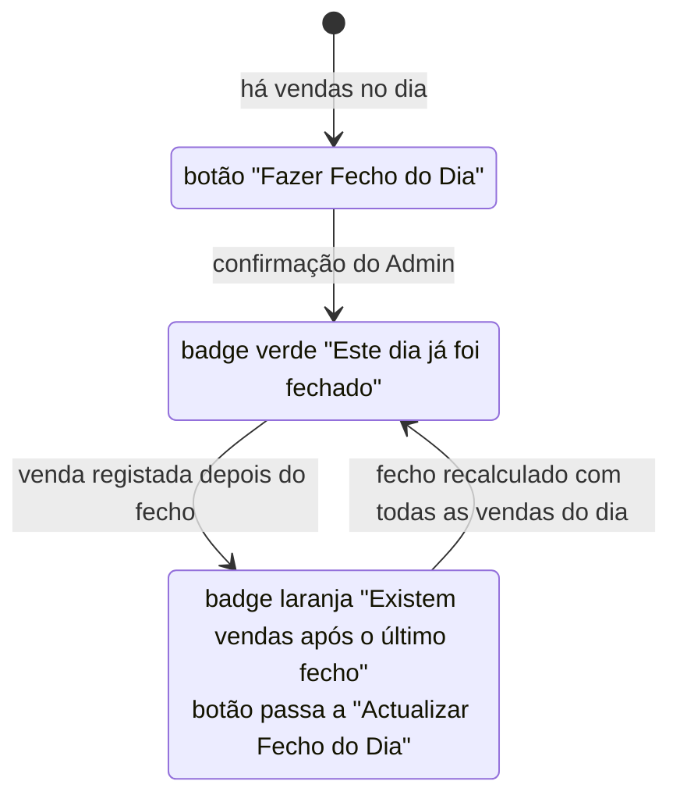
```mermaid
stateDiagram-v2
    [*] --> SemFecho: há vendas no dia
    SemFecho: botão "Fazer Fecho do Dia"
    SemFecho --> Fechado: confirmação do Admin

    Fechado: badge verde "Este dia já foi fechado"
    Fechado --> NovaSessao: venda registada depois do fecho
    NovaSessao: badge laranja "Existem vendas após o último fecho"<br/>botão passa a "Actualizar Fecho do Dia"
    NovaSessao --> Fechado: fecho recalculado com todas as vendas do dia
```

---

## Guia Integrado (por perfil)

O guia só descreve ecrãs a que o utilizador chega: `POSGuideView(isAdmin:)`
filtra os capítulos e três deles mudam de conteúdo conforme o perfil
(Visão Geral, Fecho de Caixa e Atalhos). Em macOS o
`POSGuideWindowController.open(isAdmin:)` refaz a janela se o perfil mudar
(logout/login), para o Caixa nunca herdar o guia do Admin.

```mermaid
flowchart TD
    M["MainView<br/>botão Guia"] --> G["POSGuideView(isAdmin:)"]
    G --> F{"isAdmin?"}

    F -->|Caixa| C["Visão Geral · Vendas · Pagamentos<br/>Fecho de Caixa (a sua caixa) · Atalhos"]
    F -->|Admin| A["tudo o anterior +<br/>Produtos · Lotes e Validades<br/>Relatórios · Definições · Partilha iOS"]

    G -.->|macOS| W["POSGuideWindowController<br/>open(isAdmin:) — refaz a janela se o perfil mudar"]
```

| Capítulo | Caixa | Admin |
|---|---|---|
| Visão Geral | sim (só Vendas, Pagamentos e a sua caixa) | sim (completo) |
| Vendas · Pagamentos | sim | sim |
| Fecho de Caixa | sim (fechar/actualizar a sua caixa) | sim (dia · mês · ano · exportação) |
| Atalhos | sim (Vendas e Fecho) | sim (todos) |
| Produtos · Lotes · Relatórios · Definições · Partilha iOS | não | sim |

---

## Nome do Programa (Definições → Aplicação)

O nome é escrito uma vez em Definições e lido em todo o sistema. As Views usam
`@AppStorage(Constants.appNameKey)` (refletem sem reiniciar); os serviços de
exportação e impressão leem `Constants.appName`, que valida sempre o valor
antes de o devolver.

```mermaid
flowchart LR
    SET["SettingsView · AppNameRow<br/>campo de texto + guardar"] --> VAL["Constants.sanitizedAppName<br/>trim · sem quebras de linha · máx. 40 · vazio = 'POS App'"]
    VAL --> UD["UserDefaults<br/>chave Constants.appNameKey"]

    UD --> AS["@AppStorage nas Views"]
    UD --> CN["Constants.appName<br/>getter validado"]

    AS --> LOGIN["LoginView (título)"]
    AS --> MAIN["MainView (navigationTitle)"]

    CN --> REC["ReceiptPrintService<br/>talão 80 mm / A4"]
    CN --> REP["ReportService<br/>cabeçalho e rodapé do PDF · CSV"]
    CN --> CLO["CloseExportService<br/>PDF e CSV do fecho"]
```

---

## Wizard de Utilizador (4 passos)

```mermaid
stateDiagram-v2
    [*] --> Dados: abrir UserFormView (.create ou .edit)

    Dados: ① Dados<br/>nome (≥ 2) · utilizador (≥ 3, sem espaços)
    Seguranca: ② Segurança<br/>password (≥ 6) + confirmação · barra de força
    Funcao: ③ Função<br/>Caixa ou Administrador
    Revisao: ④ Revisão<br/>resumo com lápis para voltar a um passo

    Dados --> Dados: inválido → "Seguinte" desativado
    Dados --> Seguranca: "Seguinte"
    Seguranca --> Dados: "Anterior"
    Seguranca --> Funcao: "Seguinte"
    Funcao --> Seguranca: "Anterior"
    Funcao --> Revisao: "Seguinte"
    Revisao --> Dados: lápis em Nome/Utilizador
    Revisao --> Seguranca: lápis em Password
    Revisao --> Funcao: lápis em Função

    Revisao --> Criar: modo .create
    Revisao --> Editar: modo .edit
    Criar: authViewModel.createUser(...)<br/>password em hash PBKDF2
    Editar: DatabaseManager.updateUser(...)<br/>password vazia mantém o hash actual
    Criar --> [*]
    Editar --> [*]
```

---

## Gestão de Categorias

```mermaid
flowchart TD
    PLV["ProductListView<br/>toolbar · botão Categorias"] --> CMV["CategoryManagerView"]
    PLV --> FILTRO["CategoryFilterBar<br/>Todos · Filtrar + categorias"]
    SV["SaleView"] --> FILTRO2["CategoryFilterBar<br/>Todos · Filtrar + categorias"]
    PFV["ProductFormView · passo 1"] --> GRELHA["Grelha de chips<br/>Sem categoria + cada categoria"]

    CMV -->|"Nova categoria"| CFV["CategoryFormView (.create)"]
    CMV -->|"Editar"| CFE["CategoryFormView (.edit)"]
    CMV -->|"Apagar"| ALERTA{"Confirmação:<br/>'Os X produtos desta categoria<br/>ficam sem categoria.'"}
    CMV -->|"Arrastar linha"| CVM4["CategoryViewModel.move(from:to:)"]
    CVM4 --> DBM2["DatabaseManager.reorderCategories<br/>UPDATE sort_order em transação"]

    CFV --> CVM["CategoryViewModel.create"]
    CFE --> CVM2["CategoryViewModel.update"]
    ALERTA -->|Confirmar| CVM3["CategoryViewModel.delete"]
    CVM3 --> DBM["DatabaseManager.deleteCategory<br/>UPDATE Products SET category_id = NULL<br/>antes de apagar — nunca apaga produtos"]

    CFV -.-> CI["CategoryIcons.all<br/>grelha fixa de SF Symbols"]
    CFE -.-> CI
    CFV -.-> SW["AppTheme.categorySwatches<br/>10 cores fixas"]
    CFE -.-> SW

    FILTRO -.-> BARRA["CategoryFilterBar<br/>Utils/AppTheme.swift"]
    FILTRO2 -.-> BARRA
    GRELHA -.-> CHIP
    CMV -.-> CHIP
```

---

## Wizard de Produto (2 passos)

```mermaid
stateDiagram-v2
    [*] --> Passo1: abrir ProductFormView

    Passo1: ① Identificação<br/>nome · código de barras (+ scanner) · categoria
    Passo2: ② Preços, stock e lote<br/>preço base · IVA · margem · resumo<br/>quantidade · validade / "Não expira"

    Passo1 --> Passo1: nome vazio → "Seguinte" desativado
    Passo1 --> Passo2: "Seguinte"
    Passo2 --> Passo1: "Voltar" ou clique no passo ①

    Passo2 --> Criar: modo .create + canSave
    Passo2 --> Editar: modo .edit + canSave

    Criar: createProduct(...) cria produto + primeiro lote
    Editar: updateProduct(...)<br/>stock não é escrito — deriva dos lotes
    Editar --> GestaoLotes: lista de lotes editáveis + "Adicionar lote"
    GestaoLotes: BatchViewModel.create / update / delete<br/>syncProductStock após cada escrita

    Criar --> [*]
    GestaoLotes --> [*]
```

---

## Subscrição e Período de Teste

```mermaid
stateDiagram-v2
    [*] --> PrimeiroArranque: registerFirstLaunchIfNeeded()
    PrimeiroArranque: grava a data no Keychain<br/>(sobrevive à reinstalação)
    PrimeiroArranque --> Teste

    Teste: período de teste · 15 dias
    Teste --> Ativo: compra verificada (StoreKit 2)
    Teste --> Expirado: daysRemaining chega a 0

    Expirado --> Paywall
    Paywall --> Ativo: compra ou restauro verificado
    Ativo --> Paywall: cancelamento detetado ao voltar ao 1.º plano
    Ativo --> App: hasAccess == true
    Teste --> App: hasAccess == true
    App --> [*]
```

---

## Partilha por Proximidade

Transferência de listas de stock entre o POS (macOS/iPad) e a app de recepção (iOS), pela rede local.

### Arquitectura

```mermaid
flowchart LR
    subgraph DESKTOP["🖥️ Desktop (Mac/iPad)"]
        direction TB
        A["POS Main App<br/>Vendas · Produtos · Stock Baixo"]
        B["LowStockExportService<br/>CSV · JSON · .posstock"]
        C["POSProximityService<br/>Discovery · Send Data · Device List"]
        A --> B --> C
    end

    subgraph NET["🌐 Network Layer"]
        N["Bonjour TCP + TLS-PSK<br/>_posapp._tcp<br/>NWConnection"]
    end

    subgraph IOS["📱 iOS Companion (iPhone/iPad)"]
        direction TB
        F["ProximityManager<br/>Advertising · Confirmação · Receive"]
        E["StockReceiverManager<br/>Data Parser · UI Update · Haptic"]
        D["Stock Receiver<br/>Lista Produtos · Stock · Exportação"]
        F --> E --> D
    end

    C -->|"transferência peer-to-peer cifrada"| N
    N --> F
```

### Fluxo de dados

#### 1️⃣ Inicialização e emparelhamento

```mermaid
sequenceDiagram
    autonumber
    participant I as 📱 iOS App
    participant B as 🌐 Bonjour
    participant D as 🖥️ Desktop

    I->>I: App launch
    I->>I: startAdvertising()
    I->>I: gera código de emparelhamento (6 dígitos)
    I->>I: NWListener com TLS-PSK derivada do código
    I->>B: Registar serviço _posapp._tcp
    Note over I,B: TXT Record<br/>platform: iOS<br/>ready: true<br/>device: iPhone X
    I-->>I: mostra o código no ecrã

    D->>D: User clica "Enviar para iOS"
    D->>D: startDiscovery() · NWBrowser
    D->>B: Browse _posapp._tcp
    B-->>D: Dispositivo iOS encontrado
    D-->>D: pede o código de 6 dígitos ao utilizador
```

#### 2️⃣ Descoberta de dispositivos

```mermaid
sequenceDiagram
    autonumber
    participant D as 🖥️ Desktop
    participant I as 📱 iOS

    D->>D: NWBrowser.start()
    D->>I: mDNS Query: _posapp._tcp
    I-->>D: Service Advertisement
    Note right of I: TXT: platform iOS · ready true
    D->>D: Parse results
    D->>D: Criar objetos POSDevice
    D->>D: Atualizar lista na UI
    D-->>D: Mostrar Device Picker
```

#### 3️⃣ Transferência de dados

```mermaid
sequenceDiagram
    autonumber
    participant D as 🖥️ Desktop
    participant U as 👤 Utilizador iOS
    participant I as 📱 iOS

    D->>D: User seleciona dispositivo e escreve o código
    D->>D: Preparar payload JSON
    D->>I: NWConnection com TLS-PSK

    I->>I: newConnectionHandler — ligação NÃO arranca
    I->>U: "Aceitar ligação de <dispositivo>?"
    alt Utilizador recusa
        U-->>I: Recusar
        I->>D: connection.cancel()
    else Utilizador aceita
        U-->>I: Aceitar
        I->>I: connection.start() · arranca timeout de 30 s
        I-->>D: Handshake TLS (falha se o código não bater)

        D->>I: Size header (4 bytes, UInt32 big-endian)
        I->>I: recusa acima de 10 MB ANTES de alocar
        D->>I: JSON payload
        I->>I: recebe em chunks de 64 KB
        I->>I: valida o JSON como hostil
        I->>I: converte para CSV (csvField)
        I-->>I: state = .completed · UI atualizada
        I->>D: connection.cancel()
    end
```

Uma ligação de cada vez: enquanto houver transferência ou pedido por decidir, as restantes são recusadas.

#### 4️⃣ Exportação no iOS

```mermaid
flowchart TD
    A["User toca em 'Exportar'"] --> B["Gerar CSV<br/>barcode,name,stock,qty"]
    B --> C["Guardar em diretoria da app<br/>encomenda_2026-04-13.csv"]
    C --> D["Apresentar ShareSheet"]
    D --> E{"User escolhe"}
    E --> F["AirDrop"]
    E --> G["Email"]
    E --> H["Files App"]
    E --> I["Clipboard"]
    E --> J["Outras apps"]
```

### Componentes

#### Desktop (Mac/iPad)

```mermaid
flowchart TD
    LSV["LowStockView<br/>@ObservedObject proximityService<br/>@State showDevicePicker"]
    LSV --> BTN["Botão 'Enviar para iOS'"]
    BTN --> DISC["proximityService.startDiscovery()"]
    LSV --> SHEET["Sheet: DevicePickerSheet"]
    SHEET --> LIST["List(proximityService.availableDevices)"]
    LIST --> CODE["Campo do código de emparelhamento"]
    CODE --> SEL["onSelect: sendToDevice()"]
    SEL --> EXP["LowStockExportService.exportJSON()"]
    SEL --> TX["proximityService.sendStockData(data, to:, code:)"]
```

#### iOS Companion

```mermaid
flowchart TD
    APP["POSStockReceiverApp"]
    APP --> MGR["StockReceiverManager<br/>@Published receivedProducts<br/>@Published isOnline"]
    MGR --> START["startListening()"]
    START --> ADV["startAdvertising() · gera pairingCode"]
    MGR --> PEND["pendingPeerName != nil<br/>Aceitar / Recusar"]
    PEND --> HANDLE["handleReceivedData()"]
    HANDLE --> H1["Validar JSON"]
    HANDLE --> H2["Criar ReceivedProduct[]"]
    HANDLE --> H3["Haptic feedback"]
    HANDLE --> H4["Atualizar UI"]

    APP --> MAIN["StockReceiverMainView"]
    MAIN --> EMPTY["EmptyStateView (sem dados)"]
    MAIN --> PLIST["ProductListView (com dados)"]
    PLIST --> P1["Search Bar"]
    PLIST --> P2["Stat Cards"]
    PLIST --> P3["Product Rows"]
    PLIST --> P4["Export Button"]
    MAIN --> EXPS["ExportOptionsSheet"]
    EXPS --> E1["ShareLink (CSV)"]
    EXPS --> E2["Copiar para Clipboard"]
```

### Protocolo de comunicação

#### Estrutura do pacote

```mermaid
flowchart LR
    subgraph TCP["Ligação TCP + TLS-PSK"]
        direction LR
        H["Header — 4 bytes<br/>UInt32 Big-Endian<br/>tamanho do payload"]
        P["Payload — n bytes<br/>dados JSON (UTF-8)"]
        H --> P
    end
```

| Campo | Tamanho | Formato | Exemplo | Limite |
|---|---|---|---|---|
| Header | 4 bytes | `UInt32` Big-Endian | `[0x00, 0x00, 0x00, 0x2A]` → 42 | `> 0` e `<= 10 MB`, verificado antes de alocar |
| Payload | n bytes | JSON UTF-8 | `{"version":"1.0",...}` | 10 MB · 10 000 produtos · 30 s de timeout |

#### Estado da ligação

```mermaid
stateDiagram-v2
    [*] --> Anunciar: startAdvertising()
    Anunciar --> PedidoRecebido: newConnectionHandler
    PedidoRecebido --> Recusada: já existe transferência activa
    PedidoRecebido --> AguardaConfirmacao: pendingPeerName definido

    AguardaConfirmacao --> Recusada: utilizador recusa
    AguardaConfirmacao --> Handshake: utilizador aceita

    Handshake --> Falhada: código de emparelhamento errado
    Handshake --> Ready: TLS-PSK estabelecido

    Ready --> RecebeHeader
    RecebeHeader --> Falhada: tamanho fora do limite
    RecebeHeader --> RecebePayload
    RecebePayload --> Falhada: timeout de 30 s ou dados a mais
    RecebePayload --> Validacao
    Validacao --> Falhada: JSON inválido
    Validacao --> Completa: CSV guardado

    Completa --> [*]
    Falhada --> [*]
    Recusada --> [*]
```

### Formato JSON completo

```json
{
  "version": "1.0",
  "exportDate": "2026-04-13T10:30:00Z",
  "source": "POS Desktop",
  "metadata": {
    "deviceName": "MacBook Pro de João",
    "appVersion": "2.0.1",
    "exportType": "lowStock"
  },
  "products": [
    {
      "id": 42,
      "barcode": "1234567890123",
      "name": "Produto Exemplo",
      "stock": 2,
      "orderQty": 10,
      "priceBase": 150.00,
      "ivaRate": 16.0,
      "profitMargin": 25.0,
      "finalPrice": 217.50,
      "category": "Electrónica",
      "supplier": "Fornecedor XYZ"
    }
  ],
  "summary": {
    "totalProducts": 1,
    "totalToOrder": 10,
    "criticalStock": 0,
    "lowStock": 1,
    "mediumStock": 0
  }
}
```

Campos validados na recepção: `barcode` (≤ 64 caracteres), `name` (não vazio, ≤ 200), `stock` e `orderQty` (inteiros, `0...1 000 000`). Linhas fora de gama são descartadas; envelope sem `products` ou com mais de 10 000 entradas é rejeitado inteiro.

### Estados da Interface

> ⚠️ Wireframes de UI — **única** secção deste documento em ASCII: o Mermaid não tem diagrama de wireframe equivalente. Os *estados* que os produzem estão nos diagramas de estados ao lado.

#### Desktop — Device Picker

```mermaid
stateDiagram-v2
    [*] --> Descobrindo: startDiscovery()
    Descobrindo --> SemDispositivos: nenhum resultado
    Descobrindo --> ComDispositivos: NWBrowser devolve resultados
    ComDispositivos --> Pronto: device.isReady == true
    ComDispositivos --> Aguardando: device.isReady == false
    Pronto --> PedeCodigo: user seleciona
    PedeCodigo --> AEnviar: código de 6 dígitos introduzido
    AEnviar --> [*]: sucesso
    AEnviar --> ComDispositivos: falha ou código errado
```

```
┌─────────────────────────────────────────────┐
│  Dispositivos iOS por Perto            [✕]  │
├─────────────────────────────────────────────┤
│  [Descobrindo...]                           │  ← isDiscovering = true
│  ┌─────────────────────────────────────┐   │
│  │  📱  iPhone de João          [→]    │   │  ← device.isReady = true
│  │      Pronto                         │   │
│  └─────────────────────────────────────┘   │
│  ┌─────────────────────────────────────┐   │
│  │  📱  iPad da Maria           [⏳]   │   │  ← device.isReady = false
│  │      Aguardando                     │   │
│  └─────────────────────────────────────┘   │
│  Código de emparelhamento: [ _ _ _ _ _ _ ]  │
│                          [Cancelar]         │
└─────────────────────────────────────────────┘
```

#### iOS — Main View

```mermaid
stateDiagram-v2
    [*] --> Offline
    Offline --> Online: startListening()
    Online --> AguardaConfirmacao: pendingPeerName != nil
    AguardaConfirmacao --> Online: recusado
    AguardaConfirmacao --> AReceber: aceite
    AReceber --> ComDados: transferência completa
    AReceber --> Online: falha ou timeout
    ComDados --> Exportar: botão "Exportar"
    Exportar --> ComDados: ShareSheet fechado
```

```
┌─────────────────────────────────────────────┐
│  ◄ Stock Baixo           🟢 Online          │
│  Código: 428 917                            │
├─────────────────────────────────────────────┤
│  🔍 [Pesquisar...]                          │
│                                             │
│  ┌──────────────┐  ┌──────────────┐        │
│  │ 📦 Produtos  │  │ 🛒 Encomendar│        │
│  │     12       │  │      45      │        │
│  └──────────────┘  └──────────────┘        │
│  ────────────────────────────────────────   │
│  🟠 Produto A                     Stock: 2  │
│     1234567890123               Enc: 10     │
│  🔴 Produto B                     Stock: 0  │
│     9876543210987               Enc: 20     │
│  🟡 Produto C                     Stock: 5  │
│     5555555555555               Enc: 15     │
│  ────────────────────────────────────────   │
│  [📤 Exportar Lista de Encomenda]          │
└─────────────────────────────────────────────┘
```

### Linha do tempo de uma transferência

```mermaid
timeline
    title Transferência típica (12 produtos, ~2,3 KB)
    section Descoberta
        T=0ms    : Desktop — user clica "Enviar para iOS"
        T=10ms   : Desktop — startDiscovery()
        T=50ms   : iOS — Bonjour responde com info do serviço
        T=200ms  : Desktop — dispositivo aparece na lista
    section Emparelhamento
        T=500ms  : Desktop — user seleciona e escreve o código
        T=510ms  : Desktop — preparar JSON (2,3 KB)
        T=520ms  : Desktop — NWConnection com TLS-PSK
        T=600ms  : iOS — pedido a aguardar confirmação
        T=1200ms : iOS — utilizador aceita
        T=1260ms : Ambos — handshake TLS completo
    section Transferência
        T=1265ms : Desktop — envia size header (4 bytes)
        T=1270ms : iOS — valida tamanho contra o limite de 10 MB
        T=1275ms : Desktop — envia payload JSON
        T=1420ms : iOS — dados todos recebidos
    section Conclusão
        T=1425ms : iOS — JSON validado
        T=1430ms : iOS — cria 12 objetos ReceivedProduct
        T=1435ms : iOS — haptic feedback
        T=1440ms : iOS — UI atualizada
        T=1445ms : Desktop — ligação fechada
```

### Camadas de segurança

Detalhe completo em [[SECURITY]], secção 5.3.

```mermaid
flowchart TD
    subgraph L1["1️⃣ Isolamento de rede"]
        A1["Mesma rede Wi-Fi obrigatória"]
        A2["mDNS/Bonjour só funciona na rede local"]
        A3["Não precisa de Internet"]
    end
    subgraph L2["2️⃣ Permissões"]
        B1["NSLocalNetworkUsageDescription"]
        B2["NSBonjourServices = _posapp._tcp"]
        B3["Utilizador concede Rede Local"]
    end
    subgraph L3["3️⃣ Autenticação e cifra"]
        C1["TLS com PSK (S5)"]
        C2["Chave derivada de código de 6 dígitos"]
        C3["Confirmação explícita antes de aceitar"]
        C4["Peer-to-peer — sem servidor no meio"]
    end
    subgraph L4["4️⃣ Limites de recurso"]
        D1["Payload máximo de 10 MB, verificado antes de alocar"]
        D2["Timeout de 30 s por transferência"]
        D3["Uma ligação de cada vez"]
    end
    subgraph L5["5️⃣ Validação de dados"]
        E1["Envelope JSON obrigatório"]
        E2["Tipos, comprimentos e gamas verificados"]
        E3["CSV escrito com csvField() — sem injeção de fórmula"]
    end

    L1 --> L2 --> L3 --> L4 --> L5
```

### Métricas de desempenho

Valores típicos na mesma rede Wi-Fi:

| Métrica | Valor |
|---|---|
| Tempo de descoberta | 100–500 ms |
| Handshake TLS-PSK | 50–150 ms |
| Transferência de dados | ~10 KB/ms |
| Total (10 produtos, com confirmação do utilizador) | ~2–3 s |
| Impacto na bateria | Mínimo (<1% por utilização) |
| Memória | ~5–10 MB |

Uso de rede por volume:

| Produtos | Tamanho aproximado |
|---|---|
| 10 | 2–3 KB |
| 100 | 20–30 KB |
| 1000 | 200–300 KB |
| Máximo aceite | 10 MB · 10 000 produtos |
