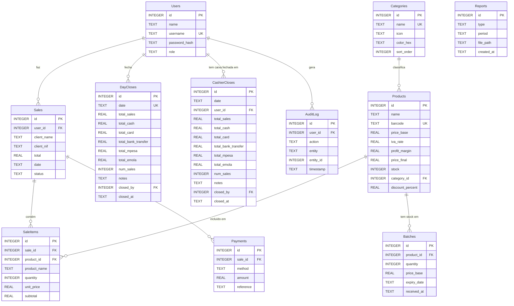
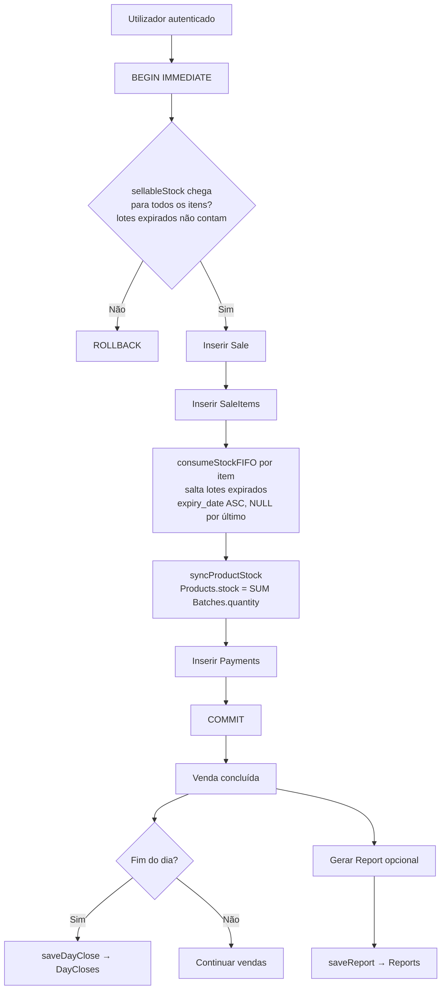
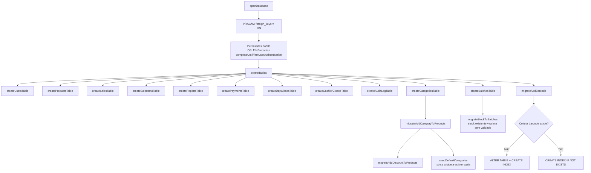
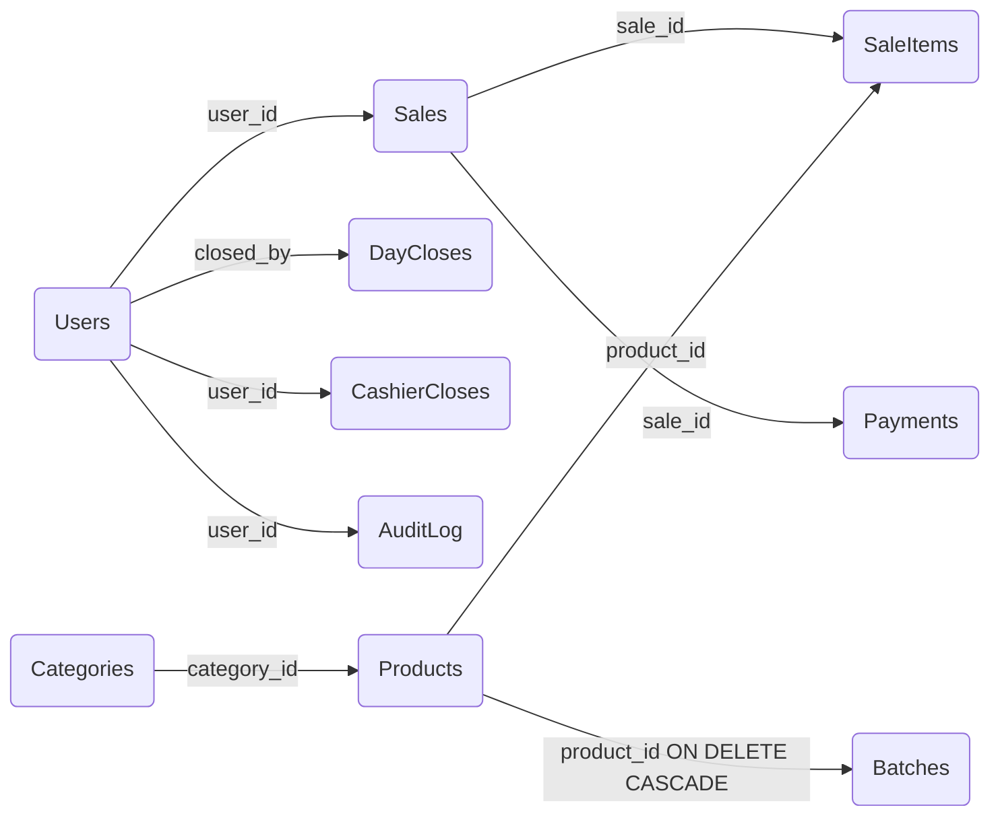

# Database Documentation

Ficheiro SQLite localizado em `ApplicationSupportDirectory/<dbName>`.  
Gerido por `DatabaseManager` (singleton) — inicializa, migra e expõe todas as operações CRUD.

---

## Diagrama Entidade-Relação



---

## Diagrama de Fluxo — Ciclo de uma Venda

A venda inteira corre dentro de uma transação (`BEGIN IMMEDIATE` … `COMMIT`).
Qualquer falha — incluindo stock insuficiente revalidado dentro da transação — faz `ROLLBACK`.



---

## Diagrama de Fluxo — Inicialização da Base de Dados



---

## Tabelas

### `Users`

Utilizadores do sistema (caixas, gestores, administradores).

```sql
CREATE TABLE IF NOT EXISTS Users (
    id            INTEGER PRIMARY KEY AUTOINCREMENT,
    name          TEXT    NOT NULL,
    username      TEXT    UNIQUE NOT NULL,
    password_hash TEXT    NOT NULL,
    role          TEXT    NOT NULL DEFAULT 'cashier'
);
```

|Coluna|Tipo|Restrições|Descrição|
|---|---|---|---|
|`id`|INTEGER|PK, AUTOINCREMENT|Identificador único|
|`name`|TEXT|NOT NULL|Nome completo do utilizador|
|`username`|TEXT|UNIQUE, NOT NULL|Nome de utilizador para login|
|`password_hash`|TEXT|NOT NULL|Hash da password (não armazenada em claro)|
|`role`|TEXT|NOT NULL|Papel: `cashier`, `manager`, `admin`, etc.|

**Operações disponíveis:** `createUser`, `fetchUsers`, `fetchUserByUsername`, `updateUser`, `deleteUser`

---

### `Products`

Catálogo de produtos com preços e stock.

```sql
CREATE TABLE IF NOT EXISTS Products (
    id            INTEGER PRIMARY KEY AUTOINCREMENT,
    name          TEXT    NOT NULL,
    barcode       TEXT    UNIQUE NOT NULL DEFAULT '',
    price_base    REAL    NOT NULL,
    iva_rate      REAL    NOT NULL DEFAULT 16.0,
    profit_margin REAL    NOT NULL DEFAULT 0.0,
    price_final   REAL    NOT NULL,
    stock         INTEGER NOT NULL DEFAULT 0,
    category_id   INTEGER REFERENCES Categories(id),
    discount_percent REAL NOT NULL DEFAULT 0.0
);

-- Índice parcial: ignora barcodes vazios
CREATE UNIQUE INDEX IF NOT EXISTS idx_products_barcode
    ON Products(barcode) WHERE barcode != '';

CREATE INDEX IF NOT EXISTS idx_products_category ON Products(category_id);
```

|Coluna|Tipo|Restrições|Descrição|
|---|---|---|---|
|`id`|INTEGER|PK, AUTOINCREMENT|Identificador único|
|`name`|TEXT|NOT NULL|Nome do produto|
|`barcode`|TEXT|UNIQUE, NOT NULL|Código de barras (índice parcial — ignora vazios)|
|`price_base`|REAL|NOT NULL|Preço de custo base|
|`iva_rate`|REAL|NOT NULL|Taxa de IVA em percentagem (default 16%)|
|`profit_margin`|REAL|NOT NULL|Margem de lucro em percentagem (default 0%)|
|`price_final`|REAL|NOT NULL|Preço final calculado: `base × (1 + profit) × (1 + iva)`|
|`stock`|INTEGER|NOT NULL|**Cache de leitura** da soma de `Batches.quantity` — não é a fonte de verdade|
|`category_id`|INTEGER|FK → `Categories(id)`, nullable|`NULL` = "Sem categoria"|
|`discount_percent`|REAL|NOT NULL, 0…90|Promoção do produto. O preço praticado na venda é `price_final × (1 − discount_percent/100)`|

**Operações disponíveis:** `createProduct`, `fetchProducts`, `fetchProduct(id:)`, `searchProducts`, `fetchProductByBarcode`, `updateProduct`, `updateStock`, `deleteProduct`, `availableStock`, `sellableStock`, `setProductDiscount`, `syncProductStock`, `productCount(inCategory:)`

**Nota de migração:** A coluna `barcode` foi adicionada via `migrateAddBarcode()` e `category_id` via `migrateAddCategoryToProducts()`; `discount_percent` via `migrateAddDiscountToProducts()` — todas para bases de dados criadas antes destas versões.

**Nota de stock:** `updateProduct` **ignora** o campo `stock` do produto recebido — o formulário trabalha sobre um retrato tirado ao abrir a sheet e repor esse valor apagava os lotes criados ou editados entretanto. Quem muda stock são os lotes (`createBatch`, `updateBatch`, `deleteBatch`, venda FIFO), que terminam em `syncProductStock`. `updateStock` (usado por `LowStockView`) também não escreve a coluna: ajusta os lotes e depois chama `syncProductStock`.

**Nota de autorização:** `deleteProduct` e qualquer `updateProduct` que altere preço (`price_base`, `iva_rate` ou `profit_margin`) exigem `DatabaseManager.currentUser?.role == .admin`. `setProductDiscount` também é operação de Admin (altera o preço praticado) e escreve `discount_changed` no `AuditLog`.

**Nota de validade:** `availableStock` soma **todos** os lotes; `sellableStock` soma só os que estão dentro do prazo (`expiry_date IS NULL OR expiry_date >= hoje`). A venda usa sempre `sellableStock` — stock expirado não se vende.

---

### `Sales`

Cabeçalho de cada venda realizada.

```sql
CREATE TABLE IF NOT EXISTS Sales (
    id          INTEGER PRIMARY KEY AUTOINCREMENT,
    user_id     INTEGER NOT NULL,
    client_name TEXT,
    client_nif  TEXT,
    total       REAL    NOT NULL,
    date        TEXT    NOT NULL,
    status      TEXT    NOT NULL DEFAULT 'completed',
    FOREIGN KEY(user_id) REFERENCES Users(id)
);
```

|Coluna|Tipo|Restrições|Descrição|
|---|---|---|---|
|`id`|INTEGER|PK, AUTOINCREMENT|Identificador único|
|`user_id`|INTEGER|FK → Users.id|Utilizador que realizou a venda|
|`client_name`|TEXT|nullable|Nome do cliente (opcional)|
|`client_nif`|TEXT|nullable|NIF do cliente para fatura (opcional)|
|`total`|REAL|NOT NULL|Valor total da venda|
|`date`|TEXT|NOT NULL|Data/hora em formato ISO 8601|
|`status`|TEXT|NOT NULL|Estado: `completed`, etc. (default `completed`)|

**Operações disponíveis:** `createSale`, `fetchSales`, `fetchSalesByDate`, `fetchSalesByMonth`, `fetchSalesByYear`

`fetchSalesByYear(year:)` liga `date LIKE 'AAAA-%'` — prefixo, não `%AAAA%`: um
`LIKE '%2026%'` apanharia também a hora de datas de outros anos (ex.: `…T20:26:…`).

---

### `SaleItems`

Linhas de detalhe de cada venda — um registo por produto vendido.

```sql
CREATE TABLE IF NOT EXISTS SaleItems (
    id           INTEGER PRIMARY KEY AUTOINCREMENT,
    sale_id      INTEGER NOT NULL,
    product_id   INTEGER NOT NULL,
    product_name TEXT    NOT NULL,
    quantity     INTEGER NOT NULL,
    unit_price   REAL    NOT NULL,
    subtotal     REAL    NOT NULL,
    FOREIGN KEY(sale_id)    REFERENCES Sales(id),
    FOREIGN KEY(product_id) REFERENCES Products(id)
);
```

|Coluna|Tipo|Restrições|Descrição|
|---|---|---|---|
|`id`|INTEGER|PK, AUTOINCREMENT|Identificador único|
|`sale_id`|INTEGER|FK → Sales.id|Venda a que pertence|
|`product_id`|INTEGER|FK → Products.id|Produto vendido|
|`product_name`|TEXT|NOT NULL|Nome do produto no momento da venda (snapshot)|
|`quantity`|INTEGER|NOT NULL|Quantidade vendida|
|`unit_price`|REAL|NOT NULL|Preço unitário no momento da venda|
|`subtotal`|REAL|NOT NULL|`quantity × unit_price`|

**Nota:** `product_name` é desnormalizado intencionalmente para preservar o histórico mesmo que o produto seja renomeado ou apagado.

**Operações disponíveis:** `fetchSaleItems(saleId:)` _(criação é interna via `createSale`)_

---

### `Payments`

Pagamentos associados a uma venda. Uma venda pode ter múltiplos pagamentos (pagamento misto).

```sql
CREATE TABLE IF NOT EXISTS Payments (
    id        INTEGER PRIMARY KEY AUTOINCREMENT,
    sale_id   INTEGER NOT NULL,
    method    TEXT    NOT NULL,
    amount    REAL    NOT NULL,
    reference TEXT    NOT NULL DEFAULT '',
    FOREIGN KEY(sale_id) REFERENCES Sales(id)
);
```

|Coluna|Tipo|Restrições|Descrição|
|---|---|---|---|
|`id`|INTEGER|PK, AUTOINCREMENT|Identificador único|
|`sale_id`|INTEGER|FK → Sales.id|Venda a que o pagamento pertence|
|`method`|TEXT|NOT NULL|Método: `cash`, `card`, `bank_transfer`, `mpesa`, `emola`|
|`amount`|REAL|NOT NULL|Valor pago por este método|
|`reference`|TEXT|NOT NULL|Referência externa (ex: nº de transação M-Pesa)|

**Operações disponíveis:** `createPayments`, `fetchPayments(saleId:)`, `fetchPaymentsByDate(datePrefix:)`

---

### `DayCloses`

Registo de fecho de caixa diário. Um registo por dia (unique em `date`).

```sql
CREATE TABLE IF NOT EXISTS DayCloses (
    id                   INTEGER PRIMARY KEY AUTOINCREMENT,
    date                 TEXT    NOT NULL UNIQUE,
    total_sales          REAL    NOT NULL DEFAULT 0,
    total_cash           REAL    NOT NULL DEFAULT 0,
    total_card           REAL    NOT NULL DEFAULT 0,
    total_bank_transfer  REAL    NOT NULL DEFAULT 0,
    total_mpesa          REAL    NOT NULL DEFAULT 0,
    total_emola          REAL    NOT NULL DEFAULT 0,
    num_sales            INTEGER NOT NULL DEFAULT 0,
    notes                TEXT    NOT NULL DEFAULT '',
    closed_by            INTEGER NOT NULL,
    closed_at            TEXT    NOT NULL,
    FOREIGN KEY(closed_by) REFERENCES Users(id)
);
```

|Coluna|Tipo|Restrições|Descrição|
|---|---|---|---|
|`id`|INTEGER|PK, AUTOINCREMENT|Identificador único|
|`date`|TEXT|UNIQUE, NOT NULL|Data do fecho (formato `YYYY-MM-DD`)|
|`total_sales`|REAL|NOT NULL|Soma total de todas as vendas do dia|
|`total_cash`|REAL|NOT NULL|Total recebido em dinheiro|
|`total_card`|REAL|NOT NULL|Total recebido por cartão|
|`total_bank_transfer`|REAL|NOT NULL|Total recebido por transferência bancária|
|`total_mpesa`|REAL|NOT NULL|Total recebido por M-Pesa|
|`total_emola`|REAL|NOT NULL|Total recebido por e-Mola|
|`num_sales`|INTEGER|NOT NULL|Número de vendas realizadas no dia|
|`notes`|TEXT|NOT NULL|Observações do operador|
|`closed_by`|INTEGER|FK → Users.id|Utilizador que fez o fecho|
|`closed_at`|TEXT|NOT NULL|Timestamp exato do fecho (ISO 8601)|

**Comportamento:** `INSERT OR REPLACE` — se o dia já foi fechado, substitui o registo anterior.

**Operações disponíveis:** `saveDayClose`, `fetchDayClose(date:)`, `fetchDayCloses(monthPrefix:)`, `isDayAlreadyClosed(date:)`

---

### `CashierCloses`

Fecho da caixa de **um** utilizador num dia. O `DayCloses` é o fecho da loja
(agregado do dia); este é o fecho individual de cada caixa, com um registo por
par `(data, utilizador)`.

```sql
CREATE TABLE IF NOT EXISTS CashierCloses (
    id                   INTEGER PRIMARY KEY AUTOINCREMENT,
    date                 TEXT    NOT NULL,
    user_id              INTEGER NOT NULL,
    total_sales          REAL    NOT NULL DEFAULT 0,
    total_cash           REAL    NOT NULL DEFAULT 0,
    total_card           REAL    NOT NULL DEFAULT 0,
    total_bank_transfer  REAL    NOT NULL DEFAULT 0,
    total_mpesa          REAL    NOT NULL DEFAULT 0,
    total_emola          REAL    NOT NULL DEFAULT 0,
    num_sales            INTEGER NOT NULL DEFAULT 0,
    notes                TEXT    NOT NULL DEFAULT '',
    closed_by            INTEGER NOT NULL,
    closed_at            TEXT    NOT NULL,
    UNIQUE(date, user_id),
    FOREIGN KEY(user_id)   REFERENCES Users(id),
    FOREIGN KEY(closed_by) REFERENCES Users(id)
);
CREATE INDEX IF NOT EXISTS idx_cashier_closes_date ON CashierCloses(date);
```

|Coluna|Tipo|Restrições|Descrição|
|---|---|---|---|
|`id`|INTEGER|PK, AUTOINCREMENT|Identificador único|
|`date`|TEXT|NOT NULL, UNIQUE com `user_id`|Data do fecho (`YYYY-MM-DD`)|
|`user_id`|INTEGER|FK → Users.id|Utilizador dono desta caixa|
|`total_sales`|REAL|NOT NULL|Total vendido por este utilizador no dia|
|`total_cash`…`total_emola`|REAL|NOT NULL|Total por método de pagamento|
|`num_sales`|INTEGER|NOT NULL|Número de vendas do utilizador nesse dia|
|`notes`|TEXT|NOT NULL|Observações do fecho|
|`closed_by`|INTEGER|FK → Users.id|Quem fez o fecho (o próprio ou o Admin)|
|`closed_at`|TEXT|NOT NULL|Timestamp exacto do fecho (ISO 8601)|

**Autorização (S3):** o perfil Caixa só pode fechar a sua própria caixa
(`closed_by == user_id`); o Admin pode fechar e reabrir qualquer uma.

**Comportamento:** `INSERT OR REPLACE` — refazer o fecho do mesmo par
`(data, utilizador)` substitui o registo anterior.

**Operações disponíveis:** `saveCashierClose(...)`, `fetchCashierCloses(date:)`, `reopenCashierClose(date:userId:)`

---

### `Reports`

Metadados dos relatórios gerados (o ficheiro real fica no filesystem).

```sql
CREATE TABLE IF NOT EXISTS Reports (
    id         INTEGER PRIMARY KEY AUTOINCREMENT,
    type       TEXT    NOT NULL,
    period     TEXT    NOT NULL,
    file_path  TEXT    NOT NULL,
    created_at TEXT    NOT NULL
);
```

|Coluna|Tipo|Restrições|Descrição|
|---|---|---|---|
|`id`|INTEGER|PK, AUTOINCREMENT|Identificador único|
|`type`|TEXT|NOT NULL|Tipo de relatório: `daily`, `monthly`, `annual` (`ReportType`)|
|`period`|TEXT|NOT NULL|Período coberto: `AAAA-MM-DD` (diário), `AAAA-MM` (mensal), `AAAA` (anual)|
|`file_path`|TEXT|NOT NULL|Caminho absoluto para o ficheiro gerado|
|`created_at`|TEXT|NOT NULL|Timestamp de criação (ISO 8601)|

**Operações disponíveis:** `saveReport`, `fetchReports`, `deleteReport(id:)`

```sql
-- deleteReport(id:) — usado pelo histórico ao apagar uma linha.
-- O ficheiro em disco é removido pela View antes desta chamada.
DELETE FROM Reports WHERE id = ?;
```

O filtro do histórico (Dia/Mês/Ano) não faz query nova: `period` é sempre
`AAAA`, `AAAA-MM` ou `AAAA-MM-DD`, por isso a comparação é feita por prefixo
em memória sobre o resultado de `fetchReports` (`ReportViewModel.filterReports`).

---

### `Categories`

Categorias de produto, com ícone SF Symbol e cor próprios.

```sql
CREATE TABLE IF NOT EXISTS Categories (
    id         INTEGER PRIMARY KEY AUTOINCREMENT,
    name       TEXT    NOT NULL UNIQUE,
    icon       TEXT    NOT NULL DEFAULT 'cube.box.fill',
    color_hex  TEXT    NOT NULL DEFAULT '5856D6',
    sort_order INTEGER NOT NULL DEFAULT 0
);
```

|Coluna|Tipo|Restrições|Descrição|
|---|---|---|---|
|`id`|INTEGER|PK, AUTOINCREMENT|Identificador único|
|`name`|TEXT|UNIQUE, NOT NULL|Nome da categoria|
|`icon`|TEXT|NOT NULL|SF Symbol|
|`color_hex`|TEXT|NOT NULL|Cor em hexadecimal sem `#` (ex: `007AFF`)|
|`sort_order`|INTEGER|NOT NULL|Ordem de apresentação; definida pelo utilizador ao arrastar (`reorderCategories`)|

**Operações disponíveis:** `fetchCategories`, `createCategory`, `updateCategory`, `deleteCategory`, `reorderCategories`

`reorderCategories(_ orderedIDs:)` grava a ordem escolhida pelo utilizador ao arrastar em `CategoryManagerView`: `sort_order` passa a ser a posição do id no array. Corre numa única transação com `sqlite3_prepare_v2` + `sqlite3_bind_int` reutilizados por `sqlite3_reset` — ou fica a ordem toda, ou nada.

`deleteCategory(id:)` corre em transação: primeiro `UPDATE Products SET category_id = NULL WHERE category_id = ?`, só depois apaga a categoria. **Nunca apaga produtos.**

**Seed inicial** (`seedDefaultCategories()`, só corre com a tabela vazia):

|Nome|Ícone|Cor|
|---|---|---|
|Bebidas|`cup.and.saucer.fill`|`007AFF`|
|Alimentos|`carrot.fill`|`FF9500`|
|Limpeza|`bubbles.and.sparkles.fill`|`34C759`|
|Higiene|`drop.fill`|`5AC8FA`|
|Papelaria|`pencil.and.ruler.fill`|`AF52DE`|
|Outros|`shippingbox.fill`|`8E8E93`|

---

### `Batches`

Lotes de stock. **Fonte de verdade do stock** — `Products.stock` é só cache da soma.

```sql
CREATE TABLE IF NOT EXISTS Batches (
    id          INTEGER PRIMARY KEY AUTOINCREMENT,
    product_id  INTEGER NOT NULL,
    quantity    INTEGER NOT NULL DEFAULT 0,
    price_base  REAL    NOT NULL,
    expiry_date TEXT,
    received_at TEXT    NOT NULL,
    FOREIGN KEY(product_id) REFERENCES Products(id) ON DELETE CASCADE
);

CREATE INDEX IF NOT EXISTS idx_batches_product ON Batches(product_id);
CREATE INDEX IF NOT EXISTS idx_batches_expiry  ON Batches(expiry_date);
```

|Coluna|Tipo|Restrições|Descrição|
|---|---|---|---|
|`id`|INTEGER|PK, AUTOINCREMENT|Identificador único|
|`product_id`|INTEGER|FK → `Products(id)`, ON DELETE CASCADE|Produto do lote|
|`quantity`|INTEGER|NOT NULL|Unidades neste lote|
|`price_base`|REAL|NOT NULL|Preço base pago neste lote — base do cálculo de perdas|
|`expiry_date`|TEXT|nullable|`yyyy-MM-dd`. `NULL` = não expira|
|`received_at`|TEXT|NOT NULL|ISO 8601|

**Operações disponíveis:** `fetchBatches(productId:)`, `fetchAllBatches`, `createBatch`, `updateBatch`, `deleteBatch`, `consumeStockFIFO`, `availableStock`, `syncProductStock`

`consumeStockFIFO(productId:quantity:)` desconta por `expiry_date ASC` com os `NULL` no fim, apaga lotes que chegam a zero e termina em `syncProductStock`. Se o stock não chegar, devolve `false` e faz `ROLLBACK`.

**Nota de migração:** `migrateStockToBatches()` cria um lote inicial (`quantity = stock`, `expiry_date = NULL`) para cada produto com `stock > 0` que ainda não tenha lotes.

---

### `AuditLog`

Registo de eventos sensíveis. **Nunca guarda passwords, hashes nem caminhos de ficheiro.**

```sql
CREATE TABLE IF NOT EXISTS AuditLog (
    id        INTEGER PRIMARY KEY AUTOINCREMENT,
    user_id   INTEGER,
    action    TEXT    NOT NULL,
    entity    TEXT    NOT NULL,
    entity_id INTEGER,
    timestamp TEXT    NOT NULL
);
```

|Coluna|Tipo|Restrições|Descrição|
|---|---|---|---|
|`id`|INTEGER|PK, AUTOINCREMENT|Identificador único|
|`user_id`|INTEGER|nullable|Autor do evento (`NULL` se desconhecido)|
|`action`|TEXT|NOT NULL|Ver tabela de ações abaixo|
|`entity`|TEXT|NOT NULL|Tabela afetada|
|`entity_id`|INTEGER|nullable|Id do registo afetado|
|`timestamp`|TEXT|NOT NULL|ISO 8601|

|`action`|Quando|
|---|---|
|`login_failed`|Tentativa de login sem sucesso|
|`user_created` / `user_updated` / `user_deleted`|Gestão de utilizadores|
|`price_changed`|`updateProduct` com alteração de preço|
|`product_deleted`|Remoção de produto|
|`sale_deleted`|Remoção de venda|
|`day_closed` / `day_reopened`|Fecho e reabertura de caixa|

**Operações disponíveis:** `logAudit(action:entity:entityId:userId:)`

---

## Relações



|Relação|Tipo|Descrição|
|---|---|---|
|`Users` → `Sales`|1 para N|Um utilizador pode fazer muitas vendas|
|`Users` → `DayCloses`|1 para N|Um utilizador pode fechar vários dias|
|`Users` → `CashierCloses`|1 para N|Cada utilizador tem um fecho de caixa por dia (`UNIQUE(date, user_id)`)|
|`Users` → `AuditLog`|1 para N|Um utilizador gera vários eventos auditados|
|`Sales` → `SaleItems`|1 para N|Uma venda tem um ou mais itens|
|`Sales` → `Payments`|1 para N|Uma venda pode ter múltiplos pagamentos (misto)|
|`Products` → `SaleItems`|1 para N|Um produto pode aparecer em múltiplos itens de venda|
|`Products` → `Batches`|1 para N|O stock de um produto vive nos seus lotes (CASCADE)|
|`Categories` → `Products`|1 para N|Uma categoria classifica vários produtos (`NULL` = sem categoria)|

---

## Migrações

|Migração|Método|O que faz|
|---|---|---|
|`migrateAddBarcode()`|ALTER TABLE + CREATE INDEX|Adiciona coluna `barcode` a `Products` se não existir; cria índice parcial|
|`migrateAddPaymentsTable()`|`createPaymentsTable()`|Cria tabela `Payments` se não existir (idempotente)|
|`migrateAddDayClosesTable()`|`createDayClosesTable()`|Cria tabela `DayCloses` se não existir (idempotente)|
|`migrateAddCategoryToProducts()`|`PRAGMA table_info` + ALTER TABLE + CREATE INDEX|Adiciona `Products.category_id` (NULL nos produtos existentes) e o índice `idx_products_category`|
|`seedDefaultCategories()`|INSERT condicional|Insere as 6 categorias por omissão, só se `Categories` estiver vazia|
|`migrateStockToBatches()`|INSERT em `Batches`|Converte o `stock` existente num lote inicial sem validade, para produtos ainda sem lotes|

---

## Segurança

|Medida|Onde|
|---|---|
|`PRAGMA foreign_keys = ON`|Imediatamente a seguir a `sqlite3_open` — por ligação|
|Permissões do ficheiro `0o600`; em iOS `FileProtectionType.completeUntilFirstUserAuthentication`|`protectDatabaseFile(at:)`|
|Todas as queries com `sqlite3_prepare_v2` + `sqlite3_bind_*` (inclui `fetchDayCloses(monthPrefix:)`, que liga `month + "%"`)|`DatabaseManager` inteiro|
|Escritas multi-passo em `BEGIN IMMEDIATE` / `COMMIT` / `ROLLBACK`|`transaction(_:)`|
|Autorização por perfil na camada de dados|`DatabaseManager.currentUser`|
|`print` de diagnóstico só em `#if DEBUG`, sem caminho da BD|`openDatabase`, `execute`, `closeDatabase`|

Operações que exigem `role == .admin`: `deleteUser`, `updateUser` (exceto o próprio utilizador, que nunca muda o seu perfil), `deleteProduct`, `updateProduct` com alteração de preço, `deleteSale`, `reopenDayClose`. O último Admin não pode ser apagado nem despromovido.

---

## Notas Técnicas

- Todos os timestamps usam **ISO 8601** (`ISO8601DateFormatter`); `Batches.expiry_date` é a exceção: só data, `yyyy-MM-dd`.
- `Products.stock` é derivado — escrever nele diretamente é apagado pelo próximo `syncProductStock`.
- `price_final` é calculado pela app: `base × (1 + profit_margin/100) × (1 + iva_rate/100)` — não é calculado por trigger SQL.
- `product_name` em `SaleItems` é um snapshot — preserva o nome histórico independentemente de alterações futuras ao produto.
- `Batches` é a única tabela com `ON DELETE CASCADE`. Com `foreign_keys = ON`, apagar um produto já vendido falha (as suas linhas em `SaleItems` protegem o histórico) — `SaleItems.product_name` mantém o nome como snapshot.
- O índice em `Products.barcode` é **parcial** (`WHERE barcode != ''`) para permitir múltiplos produtos sem código de barras.
- `DayCloses.date` é `UNIQUE` — usar `INSERT OR REPLACE` para corrigir um fecho do mesmo dia.
- `CashierCloses` é `UNIQUE(date, user_id)` — o fecho por caixa é independente do fecho da loja.
- `lastSaleDates()` devolve `MAX(Sales.date)` por produto (só vendas `completed`) — base da regra de "produto parado há 6+ meses".