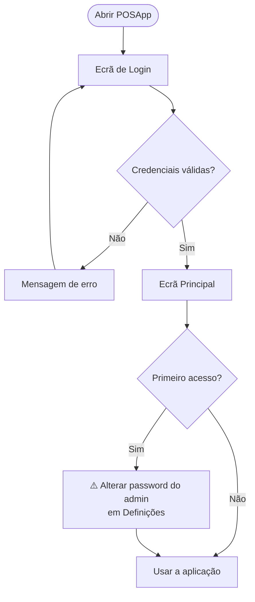
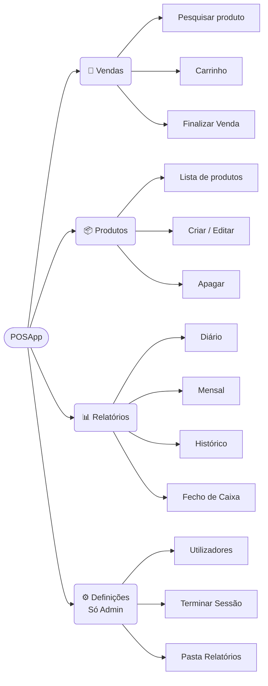
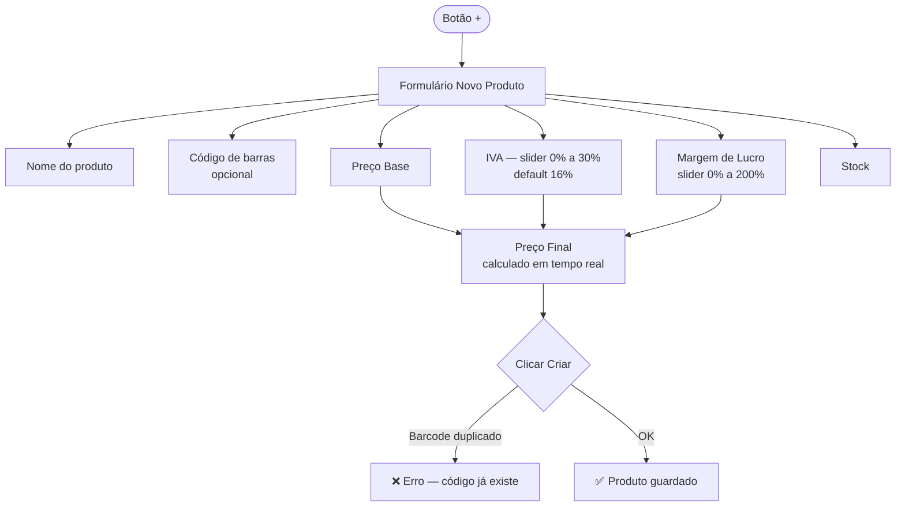
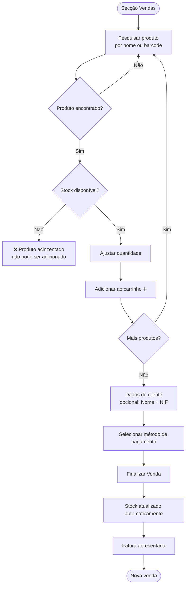
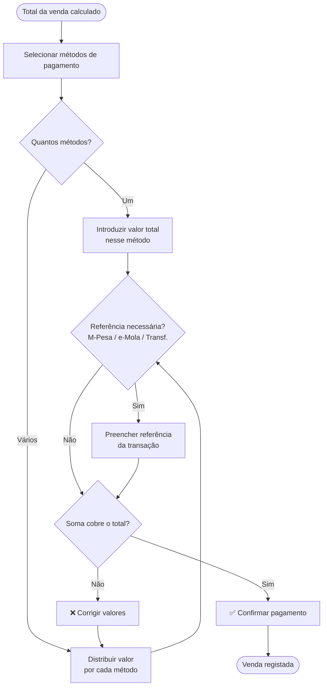
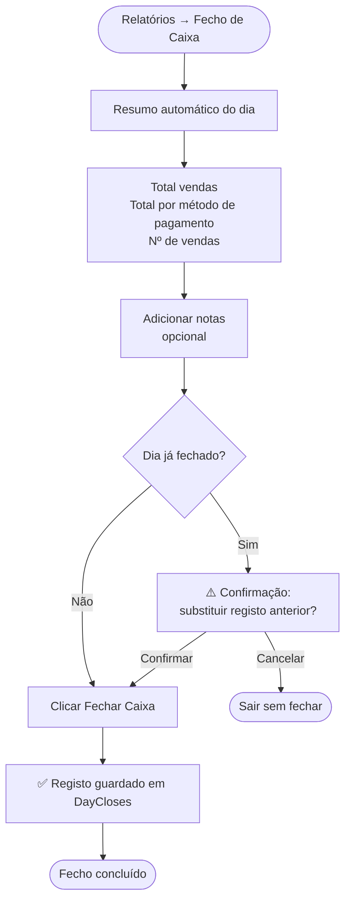
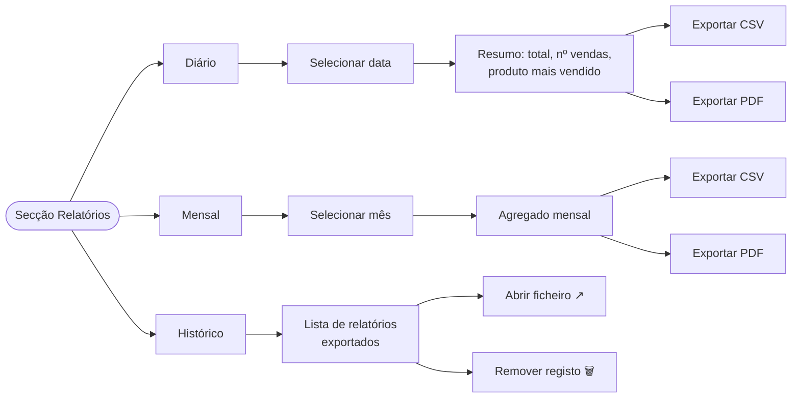
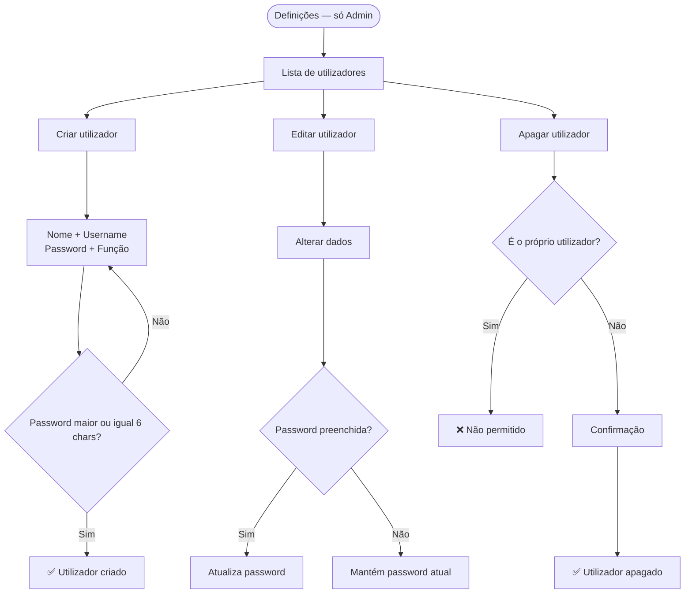
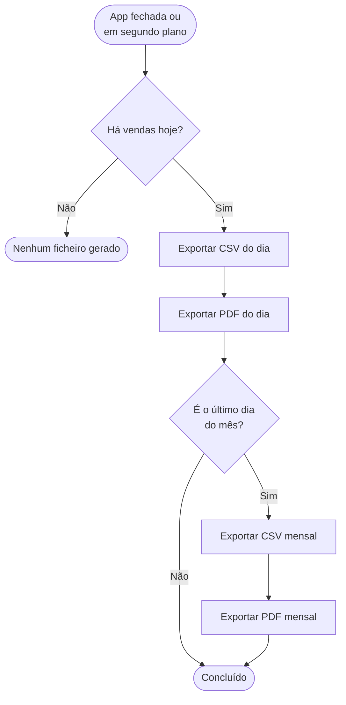
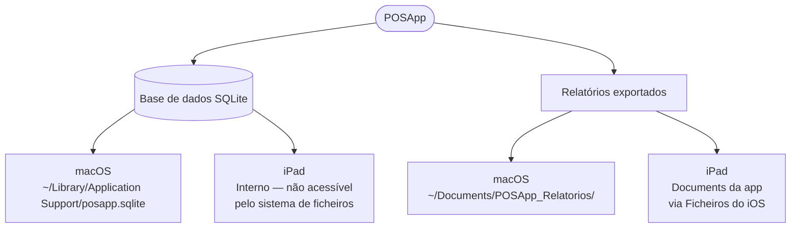

# POSApp — Guia do Utilizador

**Versão:** 1.1.0  
**Sistema:** macOS e iPadOS

---

## Índice

1. [[#Primeiro Acesso]]
2. [[#Ecrã Principal]]
3. [[#Gestão de Produtos]]
4. [[#Realizar uma Venda]]
5. [[#Métodos de Pagamento]]
6. [[#Faturas]]
7. [[#Fecho de Caixa]]
8. [[#Relatórios]]
9. [[#Definições e Utilizadores]]
10. [[#Relatórios Automáticos]]
11. [[#Dados e Ficheiros]]
12. [[#Perguntas Frequentes]]

---

## Primeiro Acesso

Ao abrir o POSApp pela primeira vez, é apresentado o ecrã de login.

**Credenciais iniciais:**

- Utilizador: `admin`
- Password: `admin123`

> ⚠️ **Importante:** Após o primeiro login, vá às **Definições** e altere a password do administrador.



---

## Ecrã Principal

Após o login, o ecrã principal divide-se em 4 secções:

|Secção|Ícone|Descrição|
|---|---|---|
|Vendas|🛒|Realizar vendas e gerir o carrinho|
|Produtos|📦|Gerir catálogo de produtos e stock|
|Relatórios|📊|Consultar e exportar relatórios|
|Definições|⚙️|Gerir utilizadores e configurações (só admins)|

**No macOS** a navegação está na barra lateral esquerda.  
**No iPad** a navegação está na barra inferior.



---

## Gestão de Produtos

### Ver produtos

Na secção **Produtos** encontra a lista completa do catálogo.

Cada produto mostra:

- Nome e código de barras (se definido)
- Preço base, IVA e margem de lucro
- Preço final (calculado automaticamente)
- Stock disponível (laranja se abaixo de 5 unidades)

### Pesquisar produto

Use a barra de pesquisa no topo da lista para filtrar produtos por **nome ou código de barras**. A pesquisa é em tempo real.

### Código de Barras

Cada produto pode ter um código de barras associado. O código de barras:

- É único no sistema — não é possível ter dois produtos com o mesmo código
- Permite pesquisa direta por scanner ou por digitação
- É opcional — produtos sem código de barras funcionam normalmente

Para usar um **scanner de código de barras** na secção de Vendas, aponte o scanner para o código do produto. O produto é adicionado automaticamente ao carrinho.

### Criar produto



**Fórmula do preço final:**

> Preço Base × (1 + Margem%) × (1 + IVA%)

_Exemplo: 10€ base + 20% margem + 16% IVA = **13,92€**_

### Editar produto

Clique em qualquer produto da lista para abrir o formulário de edição. Altere os campos e clique **Guardar**.

### Apagar produto

Na lista de produtos, deslize o item para a esquerda (iPad) ou use o botão de lixo para apagar.

> ⚠️ A eliminação é permanente. Vendas anteriores com este produto não são afetadas — o nome e preço ficam gravados no histórico.

---

## Realizar uma Venda



### Carrinho

O carrinho aparece à direita do ecrã (macOS) ou em baixo (iPad).

Para **remover um item** do carrinho, clique no ícone de lixo ao lado do item.

Para **limpar o carrinho** completamente, clique no botão **Limpar** (vermelho). Será pedida confirmação.

---

## Métodos de Pagamento

O POSApp suporta **pagamento misto** — uma venda pode ser paga com múltiplos métodos simultaneamente.

### Métodos disponíveis

|Método|Descrição|
|---|---|
|💵 Dinheiro|Pagamento em numerário|
|💳 Cartão|Cartão de débito ou crédito|
|🏦 Transferência Bancária|Transferência directa entre contas|
|📱 M-Pesa|Pagamento via M-Pesa|
|📱 e-Mola|Pagamento via e-Mola|

### Fluxo de pagamento misto



> 💡 **Exemplo:** Uma venda de 1.500 MT pode ser paga com 500 MT em dinheiro + 1.000 MT via M-Pesa.

### Referências de pagamento

Para pagamentos digitais (M-Pesa, e-Mola, Transferência), é recomendável preencher o campo **referência** com o número de confirmação da transação. Esta referência fica gravada no histórico da venda.

---

## Faturas

Após finalizar uma venda, a fatura é apresentada automaticamente com:

- Número da fatura (ID da venda)
- Data e hora
- Nome e NIF do cliente (se preenchido)
- Lista de artigos com quantidade, preço unitário e subtotal
- Métodos de pagamento utilizados
- Total da venda

Feche a fatura clicando **Fechar** para realizar uma nova venda.

---

## Fecho de Caixa

O fecho de caixa regista o resumo financeiro do dia e fecha o período para efeitos contabilísticos.

> ⚠️ Só é possível fazer **um fecho por dia**. Se necessário refazer, o registo anterior é substituído.



### O que fica registado

|Campo|Descrição|
|---|---|
|Data|Dia do fecho (`AAAA-MM-DD`)|
|Total vendas|Soma de todas as vendas do dia|
|Total dinheiro|Soma de todos os pagamentos em numerário|
|Total cartão|Soma de todos os pagamentos por cartão|
|Total transf. bancária|Soma de todas as transferências|
|Total M-Pesa|Soma de todos os pagamentos M-Pesa|
|Total e-Mola|Soma de todos os pagamentos e-Mola|
|Nº de vendas|Contagem de vendas do dia|
|Notas|Observações do operador|
|Fechado por|Utilizador que efetuou o fecho|
|Fechado às|Timestamp exacto do fecho|

### Consultar fechos anteriores

No histórico de fechos de caixa pode filtrar por mês. Para cada registo pode ver o detalhe completo por método de pagamento.

---

## Relatórios



### Diário

1. Selecione a **data** com o seletor
2. Veja o resumo: total de vendas, número de vendas, itens vendidos e produto mais vendido
3. Consulte a lista detalhada de todas as vendas do dia, incluindo os métodos de pagamento utilizados

**Exportar:** CSV (folha de cálculo) ou PDF.

### Mensal

Agrega as vendas de um mês completo. Selecione o mês com o seletor de data.

### Histórico

Lista todos os relatórios já exportados com tipo, período, data de criação e indicação se o ficheiro existe no disco.

---

## Definições e Utilizadores

> Esta secção é acessível apenas a utilizadores com perfil **Administrador**.



### Funções disponíveis

|Função|Vendas|Produtos|Relatórios|Fecho de Caixa|Definições|
|---|---|---|---|---|---|
|Caixa|✅|✅|✅|✅|❌|
|Administrador|✅|✅|✅|✅|✅|

### Terminar sessão

Clique em **Terminar Sessão** na secção "Sessão Atual" para sair.

---

## Relatórios Automáticos



### Onde ficam os ficheiros

**macOS:**

```
~/Documents/POSApp_Relatorios/
```

**iPad:**  
Pasta Documents da app, acessível via **Ficheiros** do iOS.

Para abrir a pasta diretamente no macOS, vá a **Definições → Abrir pasta de relatórios**.

---

## Dados e Ficheiros



### Estrutura dos dados

|Tabela|Conteúdo|
|---|---|
|`Users`|Utilizadores e credenciais|
|`Products`|Catálogo de produtos com preços e stock|
|`Sales`|Cabeçalho de cada venda|
|`SaleItems`|Linhas de detalhe de cada venda|
|`Payments`|Pagamentos por método de cada venda|
|`DayCloses`|Resumos de fecho de caixa diário|
|`Reports`|Metadados dos relatórios exportados|

> ℹ️ Para documentação técnica completa da base de dados, consulte `Docs/database/DATABASE.md`.

### Sincronização entre dispositivos

Na versão atual os dados são **locais em cada dispositivo**. A sincronização entre macOS e iPad está prevista para uma versão futura.

---

## Perguntas Frequentes

**O stock não está a baixar após uma venda. O que fazer?**  
Verifique se a venda foi finalizada com sucesso (fatura apresentada). Se sim, o stock foi atualizado. Refresque a lista de produtos saindo e voltando ao separador.

---

**Esqueci-me da password. Como recuperar?**  
Não é possível recuperar a password diretamente. Um administrador pode editar o utilizador e definir uma nova password em **Definições → (utilizador) → Editar**.

---

**O relatório PDF está em branco.**  
Certifique-se de que existem vendas no período selecionado antes de exportar. Se não houver vendas, o ficheiro será exportado vazio.

---

**Posso registar uma venda com pagamento parcial em dinheiro e o restante por M-Pesa?**  
Sim. Na finalização da venda, selecione ambos os métodos (Dinheiro e M-Pesa) e distribua o valor total pelos dois. Adicione a referência da transação M-Pesa no campo correspondente.

---

**O fecho de caixa já foi feito mas preciso de corrigir. Posso refazer?**  
Sim. Ao fazer um novo fecho para o mesmo dia, o registo anterior é substituído automaticamente. O histórico guarda sempre o último fecho do dia.

---

**Como alterar a taxa de IVA padrão?**  
No formulário de cada produto, ajuste o slider de IVA individualmente. O valor padrão (16%) é definido em `Constants.swift` e pode ser alterado pelo programador.

---

**O scanner de código de barras não está a reconhecer o produto.**  
Verifique que o produto tem o código de barras correctamente registado em **Produtos → (produto) → Editar**. O código deve corresponder exactamente ao que está no produto físico.

---

**Posso ter dois produtos com o mesmo código de barras?**  
Não. O sistema rejeita duplicados. Produtos sem código de barras não têm esta restrição.

---

_POSApp v1.1.0 — Sistema de Vendas para macOS e iPadOS_
