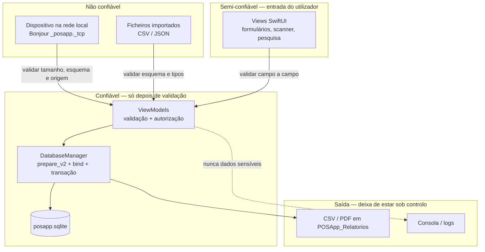

# Docs/security/SECURITY.md — Segurança do Sales POS

Documento obrigatório (`CLAUDE.md`, secção 3). Não é teoria genérica de web: são as regras desta app — SwiftUI + SQLite local, sem servidor, com partilha por rede local.

Ciclo obrigatório: **Planeamento → Desenvolvimento seguro → Autenticação → Autorização → Proteção de dados → Testes → Monitorização → Manutenção**. Cada etapa tem a sua secção abaixo.

## Divisão entre os dois documentos de segurança

| Documento                          | Responde a                                                                   | Contém                                                                                                                                                 |
| ---------------------------------- | ---------------------------------------------------------------------------- | ------------------------------------------------------------------------------------------------------------------------------------------------------ |
| `Docs/security/SECURITY.md` (este) | **O que tem de estar no código**                                             | Ameaças, regras técnicas, catálogo de validações, cinco rondas de validação, testes de segurança, auditoria do código, registo de validações aplicadas |
| `Docs/security/SECURITY_POLICY.md` | **Como o projeto garante a segurança e o que fazer quando existe uma falha** | Portões obrigatórios, papéis, severidade e prazos, resposta a incidente, comunicação de vulnerabilidade, cadência de revisão                           |

Regra de leitura: quem vai **escrever código** lê este ficheiro; quem vai **decidir, rever ou responder a uma falha** lê o `SECURITY_POLICY.md`. Nenhuma tarefa fecha sem os dois cumpridos.

---

## 1. Planeamento — o que estamos a proteger

### Ativos

| Ativo | Onde vive | Impacto se comprometido |
|---|---|---|
| Credenciais de utilizador | `Users.password_hash` (SQLite) | Acesso total ao POS, alteração de preços e stock |
| Registo de vendas e fechos de caixa | `Sales`, `SaleItems`, `Payments`, `DayCloses` | Fraude interna, contabilidade falsificada |
| Dados pessoais de clientes | `Sales.client_name`, `Sales.client_nif` + CSV/PDF exportados | Exposição de dados pessoais (nome + NIF) |
| Catálogo e stock | `Products` | Manipulação de preços, roubo encoberto por acerto de stock |
| Ficheiro da base de dados | `~/Library/Application Support/posapp.sqlite` | Tudo o acima, de uma vez |
| Relatórios exportados | `~/Documents/POSApp_Relatorios/` | Fuga de vendas e dados de clientes fora da app |

### Atacantes realistas

1. **Funcionário com perfil Caixa** — quer aceder a funções de Admin, apagar vendas ou alterar o fecho de caixa. É o atacante mais provável e tem acesso físico ao dispositivo.
2. **Dispositivo na mesma rede Wi-Fi** — o canal de proximidade anuncia-se por Bonjour e aceita ligações; qualquer aparelho na loja pode tentar injetar ou aspirar dados.
3. **Quem tenha acesso ao ficheiro** — backup, Time Machine, pen, iCloud Drive. O SQLite é texto legível se não estiver protegido.
4. **Ficheiro exportado que sai da app** — CSV/PDF enviados por WhatsApp/email escapam a qualquer controlo da app.

Fora de âmbito (não há servidor): ataques a API, XSS, CSRF, gestão de sessões HTTP.

### Fronteiras de confiança



Regra que sai do diagrama: **nada atravessa uma fronteira sem validação explícita**. O ViewModel é o ponto onde a validação acontece — não a View, não o SQL.

---

## 2. Desenvolvimento seguro — regras invioláveis

### 2.1 SQL — sempre parametrizado

Zero exceções, mesmo para valores que "vêm de dentro" (um prefixo de mês, um id, uma constante). A regra existe para não haver julgamento caso a caso.

```swift
// ERRADO — interpolação em SQL
let sql = "SELECT ... FROM DayCloses WHERE date LIKE '\(month)%';"

// CORRETO — placeholder + bind, com o texto copiado pelo SQLite
let sql = "SELECT ... FROM DayCloses WHERE date LIKE ? ORDER BY date DESC;"
sqlite3_bind_text(statement, 1, ((month + "%") as NSString).utf8String, -1, SQLITE_TRANSIENT)
```

Regras associadas:

- **Ligação de texto é sempre `SQLITE_TRANSIENT`.** Passar `nil` é `SQLITE_STATIC` e promete que o ponteiro vive até ao `sqlite3_step` — promessa falsa quando vem de uma `NSString` temporária. O valor ligado passa a lixo de forma intermitente: a query devolve o que não devia (ou nada), e uma verificação de credenciais lida isso como "erradas". Ver `Docs/development/ERRORS.md` E23.
- `LIKE`: o `%` entra no **valor**, nunca no SQL.
- Nomes de tabela/coluna nunca vêm de variáveis. Se for preciso ordenar dinamicamente, mapear a escolha do utilizador para uma lista fixa de SQL escrito à mão.
- `sqlite3_finalize` em todos os caminhos, incluindo os de erro (fuga de statement é fuga de recursos e trava a base de dados).
- `SQLITE_TRANSIENT` ou manter a `NSString` viva enquanto o statement existe — `utf8String` de um temporário pode ser libertado antes do `step`.

### 2.2 Validação de entradas — no ViewModel, antes da BD

#### 2.2.1 Análise de obstáculos — obrigatória **antes** de escrever a função

Nenhuma função ou janela nova começa a ser escrita sem esta análise. Antes do primeiro `func`, listar **cada entrada** e responder a três perguntas:

1. **O que este campo aceita hoje se ninguém o defender?** Um `TextField` aceita sempre letras, símbolos, emoji, texto colado de 10 000 caracteres e caracteres de controlo — o tipo Swift do outro lado não muda isso.
2. **O que tem de ser recusado?** Escrever a lista explícita, campo a campo (ver o catálogo 2.2.2).
3. **O que acontece se passar?** Se a resposta for "total errado", "stock negativo", "crash", "ficheiro fora da pasta", "SQL alterado" ou "aparece no relatório" — a validação é obrigatória, não opcional.

A lista sai desta análise e vai a três sítios, na mesma tarefa: item no `Docs/TODO.md`, bateria hostil no `Docs/development/TESTING.md`, linha no registo §11 quando ficar implementada.

Exemplos que esta análise tem de apanhar sempre — são os obstáculos típicos, não casos raros:

| Obstáculo | Entrada que o revela | O que acontece sem validação |
|---|---|---|
| Campo de número que aceita texto | `abc`, `12a`, `1,,5`, `--3`, `1e999` | `Double(...)` devolve `nil` (valor silenciosamente 0) ou `infinity`; total e troco ficam errados |
| Campo de número que aceita símbolos | `€10`, `10%`, `1 000`, `+`, `.` | O mesmo, e a separação de milhares depende do locale |
| Nome de pessoa com dígitos | `Ana123`, `2024` | Cliente/utilizador impossível de identificar; NIF e nome deixam de casar |
| Nome só de símbolos ou espaços | `"   "`, `"---"`, `"@@@"` | Produto sem nome legível na lista, no talão e no relatório |
| Número negativo onde não faz sentido | `-1` em stock, quantidade, preço, desconto | Stock negativo, venda a crédito involuntário, total negativo |
| Zero onde não faz sentido | `0` em preço, `0` em quantidade de venda | Venda de valor nulo, linha de venda vazia |
| Valor não finito | `NaN`, `inf` (de `0/0` ou de texto convertido) | Propaga-se em silêncio para o total, para o fecho de caixa e para o PDF |
| Texto sem limite de comprimento | 100 000 caracteres colados | Ecrã e PDF partidos, BD inchada, exportação inutilizável |
| Caracteres de controlo e separadores | `\n`, `\r`, `\t`, `\0` | Linha de CSV partida ao meio, colunas trocadas |
| Metacaracteres de SQL e fórmula | `'; DROP TABLE Products;--`, `=SOMA(1;1)`, `%` | Ver 2.1 e 5.2 — texto literal na BD, fórmula neutralizada no CSV |
| Caminho no nome | `../../evil`, `/etc/passwd` | Ficheiro escrito fora da diretoria de relatórios |
| Data fora de gama | ano `0001`, ano `9999`, validade no passado | Alertas de validade sem sentido, relatórios vazios, ordenação partida |

#### 2.2.2 Catálogo de validação por tipo de campo

O campo só passa se cumprir a coluna **Aceita**; tudo o que está em **Recusa sempre** é rejeitado com mensagem em PT, sem gravar nada.

| Campo | Aceita | Recusa sempre |
|---|---|---|
| Nome de produto | letras, dígitos, espaço, `.,-/&%()`, 1–120 caracteres depois de `trimmingCharacters(in: .whitespacesAndNewlines)` (dígitos são legítimos: `Azeite 1L`) | vazio, só espaços, só dígitos ou só símbolos (`"2024"`, `"---"`), > 120 caracteres, caracteres de controlo |
| Nome de pessoa (utilizador, cliente) | letras (com acentos), espaço, `-`, `'`, 2–80 caracteres | **dígitos**, símbolos, vazio, só espaços, caracteres de controlo |
| Username | `a-z`, `0-9`, `.`, `_`, 3–32 caracteres, minúsculas | espaços, acentos, símbolos, vazio |
| Password | ≥ 8 caracteres | as óbvias da lista curta (`admin`, `123456`, `password`, o próprio username) — ver §3 |
| Preço base, valor pago | `Double` **finito**, `> 0`, máximo 2 casas, `<= 1 000 000` | letras, símbolos, `NaN`, `infinity`, `< 0`, `0`, texto vazio convertido em 0 |
| IVA, margem, desconto (%) | `Double` finito, `>= 0` e `<= 100` (desconto `<= 90`) | letras, símbolos, `NaN`, negativos, `> 100` |
| Quantidade, stock | `Int` `>= 0`; quantidade de venda `> 0`; `<= 100 000` | letras, símbolos, sinal `-`, decimais, valor acima do limite |
| Código de barras | alfanuméricos, 4–64 caracteres | espaços, símbolos, caracteres de controlo, > 64 |
| NIF | apenas dígitos, 9 caracteres (vazio é aceite — é opcional) | letras, símbolos, comprimento diferente de 9 |
| Código de emparelhamento | exatamente 6 dígitos | letras, símbolos, comprimento diferente de 6 |
| Datas (validade, período) | entre 1970 e +10 anos; validade nova não pode estar no passado | ano fora da gama, data nula onde é obrigatória |
| Texto livre (notas, nome do programa) | ≤ 200 caracteres, sem caracteres de controlo | `\n`/`\r`/`\t`/`\0`, > 200 caracteres |
| Ficheiro/JSON de peer | esquema conhecido, tipos certos, ≤ 10 MB, ≤ máximo de linhas | campos a mais, tipos trocados, tamanho anunciado acima do limite (§5.3) |

`Double` vindo de campo de texto: converter com `Double(texto)` **e** rejeitar `!value.isFinite`. Um `nil` tratado como `0` e um `NaN` propagam-se para totais e para o fecho de caixa sem erro visível.

#### 2.2.3 A UI não é validação

`keyboardType(.decimalPad)`, `formatter:`, `Stepper` e botões escondidos são **conveniência**, não barreira:

- o teclado numérico não existe em macOS e não impede colar `abc`;
- `TextField(value:formatter:)` devolve o último valor válido em silêncio quando o texto não converte;
- o mesmo ViewModel é chamado por outro ecrã, por um teste, pela importação de ficheiro e pelo canal de proximidade — nenhum deles passa pelo teclado.

**A barreira real vive no ViewModel** e repete-se na camada de dados quando o valor decide dinheiro, stock ou perfil. A View limita-se a mostrar a mensagem de recusa.

### 2.3 Escritas com várias etapas — transação obrigatória

Venda, fecho de caixa e migrações escrevem em várias tabelas. Ou entra tudo, ou não entra nada.

```swift
func inTransaction<T>(_ work: () -> T?) -> T? {
    sqlite3_exec(db, "BEGIN IMMEDIATE;", nil, nil, nil)
    guard let result = work() else {
        sqlite3_exec(db, "ROLLBACK;", nil, nil, nil)
        return nil
    }
    sqlite3_exec(db, "COMMIT;", nil, nil, nil)
    return result
}
```

Aplica-se a: `createSale` (Sales + SaleItems + stock) junto com `createPayments`, ao fecho de caixa, e a qualquer migração que altere dados.

Ativar também `PRAGMA foreign_keys = ON;` no arranque — as `FOREIGN KEY` declaradas no esquema não são aplicadas sem isso.

### 2.4 Falhar em segurança

- Erro de leitura da BD devolve estado vazio + mensagem, nunca dados parciais apresentados como completos.
- `try?` que engole um erro de escrita é proibido em caminhos de venda, pagamento e fecho.
- Perfil desconhecido cai para o **menos** privilegiado (`.cashier`), nunca para Admin.

### 2.5 As cinco rondas de validação — obrigatórias em toda a implementação nova

Toda a função, ecrã, janela, folha ou campo novo é validado **cinco vezes**, em momentos diferentes e com meios diferentes. Uma ronda não substitui a outra, porque cada uma apanha o que a anterior não vê: a **V1** é papel, a **V2** é código lido, a **V3** é código a correr isolado, a **V4** é a app a correr a sério, a **V5** é o conjunto todo depois da última correção.

| Ronda | Quando | Meio | O que produz |
|---|---|---|---|
| **V1 — plano** | antes de escrever a primeira linha | análise de obstáculos 2.2.1 + catálogo 2.2.2 | lista escrita de entradas, do que é recusado e do que acontece se passar → item no `Docs/TODO.md` e bateria hostil no `Docs/development/TESTING.md` |
| **V2 — código** | com a função escrita, antes de compilar | releitura do código contra a lista V1, o catálogo 2.2.2 e a checklist §10 | cada entrada da V1 com guarda visível; SQL parametrizado; transação; autorização na camada de dados; nada sensível em log |
| **V3 — testes automáticos** | depois de compilar | `POSAppTests/` com a bateria hostil do `TESTING.md` §3, com prova por mutação | suite verde e prova de que a entrada hostil é mesmo **recusada** (não só que a boa é aceite) |
| **V4 — fluxo real** | app a correr, antes de dar a tarefa por feita | percorrer o fluxo ponta a ponta no ecrã: perfil **Caixa e Admin**, dados que ficam mesmo na BD, ficheiro exportado aberto, peer real na rede | a recusa aparece ao utilizador em PT e sem detalhe técnico; nada gravou a meio; o perfil restrito é travado na camada de dados; o ficheiro gerado está escapado e dentro da diretoria da app |
| **V5 — regressão e diff** | depois da **última** correção | suite completa outra vez + varrimento do `git diff` | zero interpolação em SQL, zero `print` de dados sensíveis, zero credenciais em código, ficheiros novos registados no alvo; suite verde no todo; registos escritos (§11, `TESTING.md`, `ERRORS.md`) |

Regras que fecham as rondas:

- **A V3 tem de falhar antes de passar.** Um teste que passa com e sem a validação não prova nada: retirar a guarda, ver o teste ficar vermelho, repor a guarda (prova por mutação, como no `Docs/development/TESTING.md`).
- **A V4 não se dispensa por ser manual.** O que não puder ser provado (exige credenciais, impressora, segundo dispositivo) escreve-se no `Docs/TODO.md` como por conferir — nunca se dá por verificado.
- **Qualquer correção obriga a repetir a partir da V2** — a correção é código novo e ainda não foi validada. A V5 é sempre a última coisa a correr antes de marcar `[x]`.
- **Nenhuma ronda se salta e a ordem não se troca.** Falha numa ronda bloqueia a tarefa; não se avança para a UX/UI com a V3 por fechar.
- **Cada erro encontrado nas rondas é escrito no `Docs/development/ERRORS.md`** (sintoma, causa, solução, prova) — nunca corrigido em silêncio.
- **Cada validação que passa as cinco rondas é registada na §11** deste documento.

---

## 3. Autenticação

- **Password nunca em claro** — nem em memória mais do que o necessário, nem em `print`, nem em ficheiro, nem na BD, nem em mensagem de erro.
- **Hash com KDF, não com SHA-256 simples.** SHA-256 sem sal é rápido de forçar em GPU e vulnerável a tabelas pré-computadas: duas contas com a mesma password ficam com o mesmo hash.
- Algoritmo obrigatório: **PBKDF2-HMAC-SHA256**, via `CommonCrypto` (framework do sistema — cumpre a regra de zero dependências externas).
  - sal aleatório de 16 bytes por utilizador, gerado com `SecRandomCopyBytes`;
  - mínimo **210 000** iterações (calibrar para ~250 ms no dispositivo mais lento suportado);
  - guardar tudo na coluna existente, no formato `pbkdf2$sha256$<iteracoes>$<sal_b64>$<hash_b64>` — não é preciso alterar o esquema.
- **Migração dos hashes antigos**: prefixar os existentes com `sha256$`. No próximo login com sucesso, recalcular em PBKDF2 e regravar. Nunca pedir a password ao utilizador para migrar.
- **Comparação em tempo constante**: comparar byte a byte com acumulador XOR, nunca com `==` de `String` — sem isto, o tempo de resposta diz ao atacante quantos caracteres acertou.
- **Sem enumeração de contas**: utilizador inexistente e password errada dão a **mesma** mensagem ("Credenciais inválidas.") e demoram o **mesmo** tempo (calcular sempre o KDF, mesmo quando o utilizador não existe).
- **Limite de tentativas**: após 5 falhas para o mesmo utilizador, bloquear 30 segundos, a dobrar até um máximo. Contador em memória chega — o atacante aqui é presencial.
- **Sem credenciais em código.** Nada de `password: "admin123"` no `@main`. O primeiro arranque abre um ecrã de criação do Admin; se um Admin de fábrica for mesmo necessário, gerar password aleatória, mostrá-la uma vez e forçar troca no primeiro login.
- **Política mínima de password**: 8 caracteres. Bloquear a lista curta de óbvias (`admin`, `123456`, `password`, o próprio username).

---

## 4. Autorização

- Perfis: **Admin** (tudo) e **Caixa** (vender, consultar os próprios dados).
- **A verificação vive no ViewModel ou no `DatabaseManager`.** Esconder o botão na View é UX, não segurança — a mesma função continua acessível a partir de outro ecrã, de um atalho ou de código futuro.

```swift
// ERRADO — só a View decide
if authViewModel.isAdmin { Button("Apagar utilizador") { vm.delete(user) } }

// CORRETO — a camada de dados também decide
func deleteUser(_ user: User, by actor: User) -> Bool {
    guard actor.role == .admin else { return false }   // Caixa nunca apaga
    guard actor.id != user.id else { return false }    // não apagar a própria conta
    return db.deleteUser(id: user.id)
}
```

Operações restritas a Admin: criar/editar/apagar utilizadores, apagar produtos, alterar preços, reabrir ou corrigir um fecho de caixa, apagar vendas, exportar relatórios globais, gerir a subscrição.

Regras adicionais:

- O último Admin não pode ser apagado nem despromovido.
- Um Caixa não pode elevar-se a Admin, nem sequer editando o próprio registo.
- Toda a operação sensível regista **quem** a fez (`user_id`) — ver secção 7.

---

## 5. Proteção de dados

### 5.1 Dados em repouso

- Base de dados em `Application Support` (macOS) / contentor da app (iOS) — nunca em `Documents` partilhado nem em iCloud Drive.
- Permissões do ficheiro `0o600` (só o dono lê e escreve); diretoria de relatórios `0o700`.
- iOS: `FileProtectionType.completeUntilFirstUserAuthentication` no ficheiro da BD.
- Nunca commitar a base de dados nem exportações. `.gitignore` obrigatório: `*.sqlite`, `*.sqlite-wal`, `*.sqlite-shm`, `POSApp_Relatorios/`, `*.csv`, `*.pdf`.

### 5.2 Exportações (CSV/PDF)

- **CSV tem de ser escapado.** Um nome de produto ou de cliente com vírgula, aspas ou nova linha destrói o ficheiro e mistura colunas:

```swift
func csvField(_ raw: String) -> String {
    // Neutraliza injeção de fórmulas em Excel/Numbers
    var value = raw
    if let first = value.first, "=+-@\t\r".contains(first) { value = "'" + value }
    // Escapa aspas e envolve sempre em aspas
    return "\"" + value.replacingOccurrences(of: "\"", with: "\"\"") + "\""
}
```

- **Injeção de fórmula (CSV injection)**: um campo iniciado por `=`, `+`, `-`, `@`, tab ou CR é executado como fórmula ao abrir no Excel/Numbers. Prefixar com apóstrofo, como acima.
- **Nome de ficheiro nunca vem de dados do utilizador sem sanitização.** Um cliente chamado `../../x` escreve fora da diretoria de relatórios:

```swift
let safe = client.components(separatedBy: CharacterSet.alphanumerics.inverted)
                 .joined(separator: "_")
                 .prefix(40)
```

- Exportações vão sempre para diretorias da app (`reportsDirectory()`); nunca caminhos escritos à mão.
- Relatórios com nome e NIF de cliente são dados pessoais: exportar só o necessário e avisar no ecrã que o ficheiro sai do controlo da app.

### 5.3 Partilha por proximidade (rede local)

O canal atual é TCP simples com Bonjour: qualquer dispositivo da rede descobre o serviço e liga-se. Regras obrigatórias:

- **TLS com PSK.** `NWParameters(tls:)` com `sec_protocol_options_add_pre_shared_key`, chave derivada de um **código de emparelhamento de 6 dígitos** mostrado no ecrã de quem recebe e escrito por quem envia. Sem código não há sessão.
- **Confirmação explícita do utilizador** antes de aceitar a ligação: mostrar nome do dispositivo e pedir "Aceitar / Recusar". Nunca aceitar automaticamente.
- **Limite de tamanho**: o cabeçalho de 4 bytes permite anunciar 4 GiB. Rejeitar payloads acima de **10 MB** antes de reservar memória — caso contrário um peer esgota a RAM com um número.
- **Timeout** de 30 s por transferência; ligação inativa é cancelada.
- **Uma ligação de cada vez**; recusar as restantes enquanto houver transferência ativa.
- **Validar o JSON recebido como hostil**: campos obrigatórios, tipos certos, limites de comprimento, quantidades e preços dentro de gama. Dados de um peer nunca entram na BD sem passarem pela mesma validação da secção 2.2.
- **Anunciar só quando é preciso**: parar o `NWListener` quando o ecrã de receção fecha. Um serviço permanentemente anunciado é superfície de ataque permanente.
- `Info.plist` com `NSLocalNetworkUsageDescription` e `NSBonjourServices` **coerente com o `serviceType` do código** — corrigido: `List-Storage-Info.plist` declara `_posapp._tcp`, igual ao código, e tem a descrição de uso em Português.

### 5.4 Subscrição e período de teste

- Validação de compras só por **StoreKit 2** com `VerificationResult.verified` (já é o caso). Nunca confiar num booleano guardado localmente.
- Início do período de teste em `UserDefaults` é apagado ao reinstalar e editável. Guardar no **Keychain** (sobrevive à reinstalação) ou derivar da primeira transação StoreKit.
- Falha de rede ao verificar a subscrição não pode desbloquear funcionalidades: manter o último estado verificado, com prazo.

---

## 6. Testes de segurança

Obrigatórios em `POSAppTests/`, a acompanhar cada correção:

| Teste | O que verifica |
|---|---|
| `SQLInjectionTests` | Nome de produto e prefixo de mês com `'; DROP TABLE Products;--` e `%` gravam e leem como texto literal |
| `PasswordHashTests` | Sal diferente para a mesma password; verificação certa/errada; hash antigo `sha256$` migra no login |
| `AuthorizationTests` | Caixa não apaga utilizador, não altera preço, não reabre fecho — na camada de dados, sem UI |
| `TransactionTests` | Venda que falha a meio não deixa `Sales` sem `SaleItems` nem stock descontado |
| `CSVEscapingTests` | Campos com `,` `"` `\n` e `=SOMA(1;1)` saem escapados e neutralizados |
| `ProximityPayloadTests` | Tamanho anunciado acima do limite é recusado sem alocar; JSON malformado e campos hostis são rejeitados |
| `FilenameSanitizationTests` | Cliente `../../evil` produz ficheiro dentro da diretoria de relatórios |

O índice completo das suites, a bateria de entradas hostis obrigatória e as regras de escrita de testes vivem no `Docs/development/TESTING.md` — a V3 de §2.5 corre a partir de lá, e a V4 (fluxo real) e a V5 (regressão) fecham-se com as listas do mesmo documento. Um teste de segurança novo entra nos dois sítios: no quadro acima (o que verifica) e na tabela de índice do `TESTING.md` (o que resolve).

Antes de cada versão: rever o `git diff` à procura de interpolação em SQL, `print` de dados sensíveis e credenciais em código.

---

## 7. Monitorização

- **Nunca em log**: passwords, hashes, tokens, caminho completo da BD, conteúdo de vendas, nome/NIF de cliente, payloads de rede.
- `print` de diagnóstico só dentro de `#if DEBUG`. Em `RELEASE` a app não escreve diagnósticos na consola.
- **Registo de auditoria** (tabela `AuditLog`: `id`, `user_id`, `action`, `entity`, `entity_id`, `timestamp`) para: login falhado, criação/remoção de utilizador, alteração de preço, remoção de venda, fecho e reabertura de caixa. Guarda o **quê** e o **quem**, nunca o conteúdo sensível.
- Mensagens de erro ao utilizador em PT e sem detalhe técnico: "Não foi possível guardar a venda." e não o texto de erro do SQLite.

---

## 8. Manutenção e resposta

**O processo completo vive no `Docs/security/SECURITY_POLICY.md`** — portões obrigatórios, papéis, severidade e prazos, resposta a incidente passo a passo e comunicação de vulnerabilidade. Aqui ficam só as obrigações que são do código:

- Rever esta lista a cada versão; atualizar o quadro da secção 9 quando um ponto for corrigido.
- Correção de segurança entra no `Docs/TODO.md` **à frente** de qualquer funcionalidade nova.
- Cópias de segurança da BD são tão sensíveis como a BD: mesmas permissões, nunca em pasta sincronizada sem cifra.
- Suspeita de acesso indevido: **não mexer na BD** — seguir o procedimento de resposta do `SECURITY_POLICY.md` §6.

---

## 9. Estado atual — auditoria do código

Levantamento feito sobre o código em árvore. Severidade: **A** = corrigir já, **M** = corrigir antes da próxima versão, **B** = dívida assumida.

Estado: `[x]` corrigido e verificado · `[~]` parcialmente corrigido · `[ ]` por corrigir.

| # | Estado | Sev. | Problema | Onde | Correção |
|---|---|---|---|---|---|
| S1 | [x] | A | SQL por interpolação de string no filtro de mês (`LIKE '\(month)%'`) | `Database/DatabaseManager.swift:592` | `LIKE ?` com bind de `month + "%"` |
| S2 | [x] | A | Password em SHA-256 sem sal nem KDF | `ViewModels/AuthViewModel.swift:41-45` | PBKDF2-HMAC-SHA256 via CommonCrypto, sal por utilizador, migração automática no login |
| S3 | [x] | A | Autorização só na UI — `isAdmin` só é consultado em Views | `Views/MainView.swift:37,107`, `Views/Settings/SettingsView.swift:73`, `Views/DayClose/DayCloseView.swift:196,346` | Verificação de perfil no ViewModel/`DatabaseManager` em todas as operações restritas |
| S4 | [x] | A | Zero transações SQL: venda escreve Sales, SaleItems, stock e Payments sem atomicidade | `Database/DatabaseManager.swift:387-411`, `ViewModels/SaleViewModel.swift:60-83` | `BEGIN IMMEDIATE` / `COMMIT` / `ROLLBACK` a envolver a venda inteira |
| S5 | [x] | A | Proximidade sem TLS nem autenticação; ligação aceite automaticamente | `List_Storage/ProximityManager.swift:96,211`, `Views/POSProximityService.swift:38,164` | TLS com PSK a partir de código de 6 dígitos + confirmação explícita do utilizador |
| S6 | [x] | A | Password de Admin em código, recriada a cada arranque | `Sales_Project/Sales_ProjectApp.swift:16-21` | Ecrã de criação do primeiro Admin; nunca password fixa |
| S7 | [x] | M | Payload de rede sem limite (`UInt32` até 4 GiB acumulados em memória) nem timeout | `List_Storage/ProximityManager.swift:263-308` | Recusar acima de 10 MB antes de alocar; timeout de 30 s |
| S8 | [x] | M | CSV sem escaping e sem proteção contra injeção de fórmula | `Views/Reports/ReportService.swift:19-40` (e escape parcial em `Views/LowStockExportService.swift:36`) | Função `csvField(_:)` única, usada por todos os exportadores |
| S9 | [x] | M | Nome de ficheiro construído a partir do nome do cliente (traversal) | `Views/Reports/ReportService.swift:73-76` | Sanitizar para alfanuméricos + `_`, limite de 40 caracteres |
| S10 | [x] | M | Login revela se o utilizador existe; comparação de hash não é em tempo constante; sem limite de tentativas | `ViewModels/AuthViewModel.swift:13-26` | Mensagem única, KDF sempre calculado, comparação constante, bloqueio após 5 falhas |
| S11 | [x] | M | Base de dados sem permissões restritas nem proteção de ficheiro em iOS | `Database/DatabaseManager.swift:17-29` | `0o600` + `FileProtectionType.completeUntilFirstUserAuthentication` |
| S12 | [x] | M | Caminho da BD e dados de transferência impressos na consola (25 `print` só em `ProximityManager`) | `Database/DatabaseManager.swift:25`, `List_Storage/ProximityManager.swift` | `#if DEBUG` e remover conteúdo sensível das mensagens |
| S13 | [x] | M | `PRAGMA foreign_keys` desativado — as `FOREIGN KEY` do esquema não são aplicadas | `Database/DatabaseManager.swift:17-29` | `PRAGMA foreign_keys = ON;` logo após abrir |
| S14 | [x] | B | Período de teste em `UserDefaults`, reposto ao reinstalar | `Views/Subscription/TrialManager.swift:10-17` | Keychain ou data da primeira transação StoreKit |
| S15 | [x] | B | Stock validado contra cópia em memória (TOCTOU entre carrinho e fecho da venda) | `ViewModels/SaleViewModel.swift:19-23` | Revalidar stock dentro da transação da venda |
| S16 | [x] | B | `NSBonjourServices` do plist (`_pos-csv-share._tcp`) não corresponde ao `serviceType` do código (`_posapp._tcp`); falta `NSLocalNetworkUsageDescription` | `List-Storage-Info.plist` | Alinhar os dois e acrescentar a descrição de uso |
| S17 | [x] | B | Sem `.gitignore` na raiz — risco de commitar `posapp.sqlite` ou relatórios | raiz do repositório | `.gitignore` com `*.sqlite*`, `POSApp_Relatorios/`, `*.csv`, `*.pdf` |

**S12**: todos os `print` de `Database/DatabaseManager.swift`, `List_Storage/ProximityManager.swift`, `Views/POSProximityService.swift` e `Views/Reports/ReportService.swift` estão dentro de `#if DEBUG`, sem caminho da BD nem conteúdo de transferências.

**S5** está ligado de ponta a ponta: `List_Storage/ProximityReceiverView.swift` mostra o `pairingCode` e apresenta "Aceitar / Recusar" quando há `pendingPeerName`; `Views/Products/LowStockView.swift` pede o código de 6 dígitos antes de permitir escolher o dispositivo de destino.

As correções estão no `Docs/TODO.md`, secção 1.0.1, pela mesma ordem de severidade.

---

## 10. Checklist antes de fechar uma tarefa

- [ ] Todo o SQL novo usa `sqlite3_prepare_v2` + `sqlite3_bind_*`; nenhuma interpolação.
- [ ] Toda a ligação de texto passa `SQLITE_TRANSIENT` (nunca `nil`/`SQLITE_STATIC`) — ver E23.
- [ ] Entradas do utilizador validadas no ViewModel (vazio, gama, comprimento, `isFinite`).
- [ ] Escritas em várias tabelas dentro de transação com `ROLLBACK`.
- [ ] Operação restrita verifica o perfil na camada de dados/ViewModel, não só na View.
- [ ] Nenhuma password, hash, caminho de BD ou dado de cliente em `print`, erro visível ou ficheiro exportado.
- [ ] Dados vindos da rede ou de ficheiro validados antes de tocar na BD.
- [ ] CSV escapado e nome de ficheiro sanitizado.
- [ ] Teste de segurança correspondente escrito e a passar.
- [ ] **Análise de obstáculos (2.2.1) escrita antes de codificar**, com a lista do que tem de ser recusado.
- [ ] **Cinco rondas de §2.5 fechadas**: V1 (plano), V2 (código relido), V3 (testes hostis), V4 (fluxo real na app, Caixa e Admin), V5 (regressão + `git diff` limpo) — repetidas a partir da V2 depois da última correção.
- [ ] **Bateria hostil no `Docs/development/TESTING.md`** e a passar; pelo menos um teste provado por mutação.
- [ ] **Cada erro encontrado documentado no `Docs/development/ERRORS.md`** (sintoma, causa, solução, prova).
- [ ] **Validação nova registada na §11** deste documento.
- [ ] Se a análise revelou uma regra em falta ou errada neste documento, **o documento foi corrigido na mesma tarefa** (`CLAUDE.md` §3.5).

---

## 11. Registo de validações aplicadas

Toda a validação que passa as cinco rondas de §2.5 entra aqui, na mesma tarefa (é parte da V5). Os IDs são `R…` para não colidirem com as rondas `V1–V5`. É este registo que evita reinventar (ou esquecer) a mesma regra no ecrã seguinte.

| # | Data | Função / ecrã | Campo | Regra aplicada (o que é recusado) | Onde vive | Teste |
|---|---|---|---|---|---|---|
| R1 | 2026-08-17 | Criar/editar produto | Nome | vazio ou só espaços depois de `trimmingCharacters` | `ViewModels/ProductViewModel.swift:35,70` | — (por cobrir) |
| R2 | 2026-08-17 | Criar/editar produto | Preço base | `<= 0` | `ViewModels/ProductViewModel.swift:39,74` | — (por cobrir) |
| R3 | 2026-08-17 | Criar produto | Stock | negativo | `ViewModels/ProductViewModel.swift:43` | — (por cobrir) |
| R4 | 2026-08-17 | Criar produto | IVA, margem | negativos | `ViewModels/ProductViewModel.swift:47` | — (por cobrir) |
| R5 | 2026-08-17 | Criar produto | Validade | data anterior a hoje | `ViewModels/ProductViewModel.swift:51` | — (por cobrir) |
| R6 | 2026-08-17 | Administração — editar lote | Quantidade | negativa | `ViewModels/AdminViewModel.swift:478` | `AdminEditingTests` |
| R7 | 2026-08-17 | Administração — editar lote | Preço base | negativo | `ViewModels/AdminViewModel.swift:482` | `AdminEditingTests` |
| R8 | 2026-08-17 | Administração — repor stock | Stock | negativo | `ViewModels/AdminViewModel.swift:496` | `AdminEditingTests` |
| R9 | 2026-08-17 | Promoção | Desconto (%) | fora de `0…90` | `ViewModels/AdminViewModel.swift:510` | — (por cobrir) |
| R10 | 2026-08-17 | Criar utilizador | Nome, username, password | vazios ou só espaços | `ViewModels/AuthViewModel.swift:81-83` | — (por cobrir) |
| R11 | 2026-08-17 | Categorias | Nome | vazio depois de `trimmingCharacters` | `ViewModels/CategoryViewModel.swift:94` | — (por cobrir) |
| R12 | 2026-08-17 | Exportação CSV (todos os exportadores) | Qualquer texto | separadores, aspas, nova linha e fórmula (`=`, `+`, `-`, `@`, tab, CR) | `Utils/CSVField.swift:24` | `CSVEscapingTests` |
| R13 | 2026-08-17 | Relatórios — nome de ficheiro | Nome de cliente | não alfanuméricos, travessia `../`, > 40 caracteres | `Views/Reports/ReportService.swift` | `FilenameSanitizationTests` |
| R14 | 2026-08-17 | Proximidade — receção | Tamanho anunciado | `0` e acima de 10 MB, antes de alocar | `List_Storage/ProximityManager.swift:58,386` | `ProximityPayloadTests` |
| R15 | 2026-08-17 | Proximidade — emparelhamento | Código | diferente de 6 dígitos; sem código não há sessão TLS | `List_Storage/ProximityManager.swift` | `ProximityPayloadTests` |
| R16 | 2026-08-17 | Login | Password | comparação em tempo constante, mensagem única, bloqueio após 5 falhas | `ViewModels/AuthViewModel.swift` | `PasswordHashTests`, `AuthorizationTests` |
| R17 | 2026-08-17 | Proximidade — payload | JSON do peer | esquema errado, campos hostis, lista acima do máximo | `List_Storage/ProximityManager.swift` | `ProximityPayloadTests` |
| R18 | 2026-08-19 | Login | Utilizador, password | vazio ou só espaços; username acima de 64 caracteres ou com caracteres de controlo (`\n`, `\r`, `\t`, `\0`); password acima de 128 caracteres — tudo recusado antes de consultar a base de dados e antes do KDF, com mensagem única `Credenciais inválidas.` | `ViewModels/AuthViewModel.swift:39-51`, limites em `Utils/Constants.swift` | `LoginInputTests` |

### 11.1 Lacunas conhecidas — o catálogo 2.2.2 ainda não está todo no código

Levantamento honesto do estado atual (não fabricar cobertura que não existe). **Toda a implementação nova cumpre já o catálogo completo**; estas lacunas fecham-se no ecrã que for tocado a seguir, com entrada própria no `Docs/TODO.md`.

| # | Lacuna | Sev. | Onde se nota |
|---|---|---|---|
| G1 | Campos numéricos não recusam letras/símbolos explicitamente — texto que não converte cai a `0`/`nil` em vez de dar erro ao utilizador | M | formulários de produto, lote, stock, pagamento |
| G2 | Sem verificação de `isFinite` em `Double` vindo de texto (`NaN`/`infinity` passam) | M | preço, IVA, margem, valor pago |
| G3 | Nome de pessoa (utilizador, cliente) aceita dígitos e símbolos | M | criação de utilizador, cliente da venda |
| G4 | Sem limite máximo de comprimento nos campos de texto (nome, notas, cliente) | B | produto, cliente, nome do programa |
| G5 | NIF e código de barras sem validação de formato (dígitos/alfanuméricos, comprimento) | B | venda com dados de cliente, produto |
| G6 | Datas sem limite superior de gama (ano fora do razoável é aceite) | B | validade do lote |
