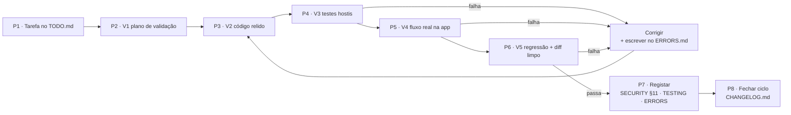

# Docs/security/SECURITY_POLICY.md — Política de segurança do Sales POS

Responde a uma única pergunta: **como é que este projeto garante a sua segurança e o que se faz quando existe uma falha?**

Documento obrigatório (`CLAUDE.md` §3). É o par do `Docs/security/SECURITY.md`:

| Documento                                 | Responde a                                                                                                           |
| ----------------------------------------- | -------------------------------------------------------------------------------------------------------------------- |
| `Docs/security/SECURITY.md`               | **O que tem de estar no código** — ameaças, regras técnicas, catálogo de validações, cinco rondas, testes, auditoria |
| `Docs/security/SECURITY_POLICY.md` (este) | **Como se garante e o que fazer quando falha** — portões, papéis, severidade, resposta a incidente, comunicação      |

---

## 1. Âmbito

Aplica-se a todo o código, documentação e ficheiros gerados por este projeto: app macOS/iOS, base de dados SQLite local, relatórios exportados e canal de partilha por proximidade na rede local.

Não há servidor, conta remota nem telemetria: **a superfície de ataque é o dispositivo da loja, a rede local e os ficheiros que saem da app**. Quem toca no projeto — pessoa ou agente — está abrangido por esta política.

O princípio que decide dúvidas: **uma funcionalidade insegura não é uma funcionalidade incompleta, é uma funcionalidade que não existe**. Não se entrega com a validação "para depois".

---

## 2. Como se garante — os portões obrigatórios

A segurança não é uma revisão no fim; são oito portões — um por cada uma das **cinco rondas de validação** (`SECURITY.md` §2.5), mais a tarefa, a documentação e o fecho. Nenhum se salta. Cada portão tem uma prova concreta: se a prova não existir, o portão está fechado.

| Portão | Momento | Prova exigida | Bloqueia |
|---|---|---|---|
| **P1 — Tarefa escrita** | antes de tocar no projeto | item no `Docs/TODO.md`, com o ficheiro que toca | codificar sem tarefa |
| **P2 — V1: plano de validação** | antes da primeira linha | análise de obstáculos (`SECURITY.md` §2.2.1) + lista do que é recusado + bateria hostil no `Docs/development/TESTING.md` | implementar às cegas |
| **P3 — V2: código relido** | função escrita, antes de compilar | cada entrada da V1 com guarda; SQL parametrizado; transação; autorização na camada de dados; nada sensível em log | avançar com validação só na UI |
| **P4 — V3: testes hostis** | depois de compilar | suite verde + pelo menos um teste provado por mutação (falha com a guarda retirada) | dar por feito sem prova |
| **P5 — V4: fluxo real** | app a correr | fluxo percorrido no ecrã com perfil **Caixa e Admin**; recusa visível em PT; nada gravado a meio; ficheiro exportado conferido. O que não puder ser provado fica escrito no `TODO.md` | entregar o que só funciona no teste |
| **P6 — V5: regressão e diff** | depois da última correção | suite completa outra vez + `git diff` sem interpolação em SQL, sem `print` sensível, sem credenciais, com os ficheiros novos registados no alvo | fechar com regressão por ver |
| **P7 — Documentação** | antes de fechar a tarefa | linha no registo `SECURITY.md` §11, linha no índice do `TESTING.md`, entrada no `ERRORS.md` por cada erro encontrado | conhecimento perdido |
| **P8 — Fecho do ciclo** | `TODO.md` todo `[x]` | texto movido para o `CHANGELOG.md` e índice recalculado | histórico partido |

Regra do retorno: **a correção volta sempre ao P3**, venha a falha do P4, do P5 ou do P6, e nunca segue direta para o P7 — código corrigido é código novo e ainda não foi validado.

**UX e UI só arrancam depois do P4.** O ecrã bonito de uma função que aceita `-1` no stock é um ecrã bonito que estraga o inventário. O P5 e o P6 correm já com a UI feita.

---

## 3. Papéis

| Papel | Quem | Responsabilidade |
|---|---|---|
| **Responsável do projeto** | o dono do repositório | decide severidade e prazo, aceita ou recusa dívida assumida (`B`), é quem é avisado num incidente |
| **Quem implementa** (pessoa ou agente) | quem toca no código | cumpre os oito portões, escreve a análise de obstáculos, os testes e o registo; **não decide sozinho aceitar risco** |
| **Quem revê** | quem lê o diff | verifica as provas dos portões, não a boa vontade de quem escreveu |

Não existe "aprovar com ressalva": ou a prova está no repositório, ou o portão não passou.

---

## 4. Severidade e prazos

Mesma escala do quadro de auditoria (`SECURITY.md` §9):

| Sev. | Significa | Prazo | Exemplo |
|---|---|---|---|
| **A** | perda de dados, acesso indevido ou fraude possível **agora** | corrige-se **antes de qualquer outro trabalho**, incluindo funcionalidades a meio | SQL por interpolação, password sem KDF, autorização só na UI, canal sem TLS |
| **M** | falha explorável com condições ou consequência limitada | antes da versão seguinte | payload sem limite, CSV sem escape, nome de ficheiro sem sanitização, campo numérico que aceita texto |
| **B** | dívida assumida e escrita | fecha-se quando o código for tocado | período de teste em `UserDefaults`, limites de comprimento em falta |

Uma correção de segurança entra no `Docs/TODO.md` **à frente** de qualquer funcionalidade nova. Nenhum item `A` ou `M` fica no registo sem data de decisão.

---

## 5. Cadência de revisão

| Quando | O que se revê |
|---|---|
| Cada tarefa | portões P1–P8 (as cinco rondas incluídas); checklist `SECURITY.md` §10 |
| Cada fecho de ciclo do `TODO.md` | quadro de auditoria §9 e lacunas §11.1 — o que ficou por fechar continua listado, não desaparece |
| Cada versão | `git diff` completo à procura de interpolação em SQL, `print` de dados sensíveis, credenciais em código; permissões dos ficheiros; `Info.plist` |
| Cada alteração da plataforma (macOS/iOS/Xcode) | APIs de segurança usadas (`CommonCrypto`, `Network`, `StoreKit`, proteção de ficheiros) |

Quando esta revisão encontra uma regra em falta ou errada, **corrige-se o documento na mesma tarefa** — o `SECURITY.md` e este ficheiro crescem com o projeto (`CLAUDE.md` §3.5).

---

## 6. O que fazer quando existe uma falha

Vale para falha encontrada em teste, em uso real ou por suspeita. **Ordem fixa, sem saltos.**

1. **Parar.** Não continuar a implementar por cima. Se a falha expõe dados ou dinheiro, parar também o uso da funcionalidade afetada.
2. **Conter.** Desligar o que dá acesso: parar o `NWListener` da proximidade, deixar de exportar relatórios, retirar o perfil indevido. **Não apagar nem "arrumar" nada** — apagar destrói a prova.
3. **Avaliar.** Responder por escrito no `Docs/TODO.md`: o que é afetado, desde quando, que dados podem ter saído, quem teve acesso. Atribuir severidade (§4).
4. **Corrigir.** Correção na causa, não no sintoma; à frente de tudo o resto se for `A` ou `M`.
5. **Verificar.** Repetir **V2 a V5** (`SECURITY.md` §2.5): código relido, teste que falha sem a correção (prova por mutação), fluxo real percorrido na app e regressão completa com o `git diff` varrido.
6. **Documentar**, na mesma tarefa:
   - `Docs/development/ERRORS.md` — sintoma, causa, solução, prova;
   - `Docs/security/SECURITY.md` §9 (quadro de auditoria) e §11 (validação nova aplicada);
   - `Docs/TODO.md` → `Docs/CHANGELOG.md` no fecho do ciclo.
7. **Comunicar** ao responsável do projeto: o que aconteceu, o que foi corrigido, o que fica por fazer. Sem detalhe sensível em ficheiro partilhado.

### 6.1 Suspeita de acesso indevido ao dispositivo ou à base de dados

Além dos passos acima, por esta ordem:

1. **Copiar a base de dados para análise antes de mexer** (`posapp.sqlite` + `-wal` + `-shm`), para pasta com as mesmas permissões restritas.
2. **Rever o `AuditLog`**: logins falhados, alterações de preço, remoções de venda, reaberturas de fecho de caixa — quem e quando.
3. **Forçar troca de todas as passwords** e confirmar que o último Admin é conhecido e legítimo.
4. **Rever a diretoria de relatórios**: que ficheiros existem, quais saíram do dispositivo.
5. Só depois repor a operação normal.

---

## 7. Comunicar uma vulnerabilidade

Projeto privado, sem canal público. Quem encontrar uma falha:

- **Não escrever o detalhe da exploração** em ficheiro partilhado, em issue pública nem em mensagem de erro visível na app;
- abrir item no `Docs/TODO.md` com o prefixo **`SEC:`**, a descrever o efeito e o ficheiro afetado — não o passo a passo do ataque;
- avisar o responsável do projeto diretamente;
- tratar a falha como `A` até o responsável decidir outra severidade.

Falha comunicada e ainda não corrigida **fica no `TODO.md`** — nunca só na cabeça de quem a encontrou.

---

## 8. Dados pessoais

A app guarda nome e NIF de cliente nas vendas e reproduz-nos em CSV/PDF. Regras da política:

- exportar **só o necessário** e avisar no ecrã que o ficheiro deixa de estar sob controlo da app;
- ficheiros exportados vivem em diretorias da app (`0o700`); nunca em pasta sincronizada sem cifra;
- apagar exportações de teste no fim de cada verificação;
- se um ficheiro com dados pessoais sair para fora (email, WhatsApp, pen), tratar como **incidente** (§6): registar o que saiu, para quem, e avisar o responsável.

---

## 9. Manutenção e continuidade

- **Zero dependências externas** (`CLAUDE.md` §4) — não há cadeia de fornecimento para vigiar, e é para continuar assim.
- Cópias de segurança são tão sensíveis como a base de dados: mesmas permissões, mesma exclusão de pastas sincronizadas.
- `.gitignore` obrigatório para `*.sqlite*`, `POSApp_Relatorios/`, `*.csv`, `*.pdf` — verificar antes de cada commit.
- Ao mudar de máquina ou de pessoa responsável: rever esta política, os Admins existentes e as exportações guardadas.

---

## 10. Checklist de resposta rápida

- [ ] Parei de implementar por cima da falha.
- [ ] Contive o acesso sem apagar prova.
- [ ] Avaliei âmbito e severidade por escrito no `Docs/TODO.md`.
- [ ] Corrigi a causa, não o sintoma.
- [ ] Teste que falha sem a correção, a passar com ela; suite completa verde.
- [ ] `ERRORS.md`, `SECURITY.md` §9/§11 e `TESTING.md` atualizados.
- [ ] Responsável do projeto avisado.
